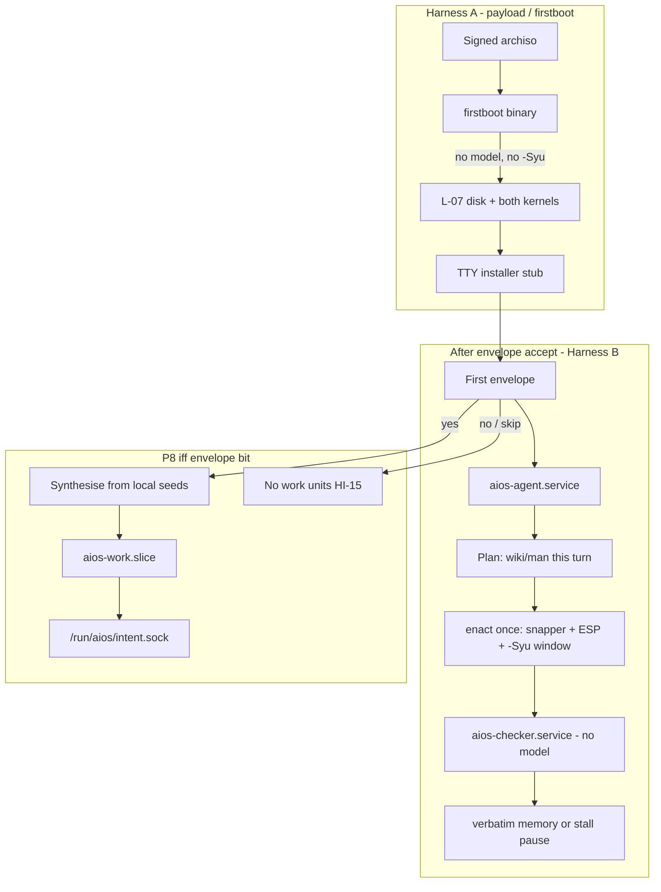
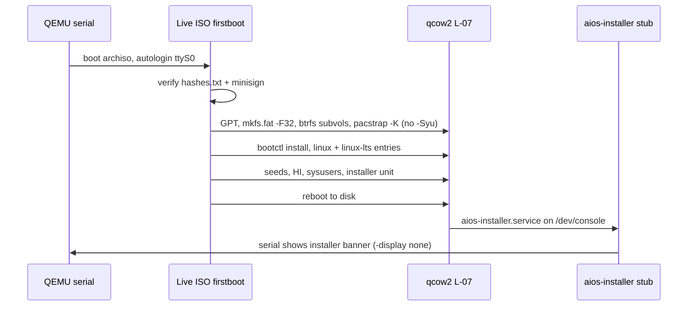
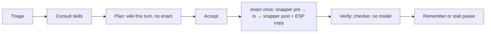
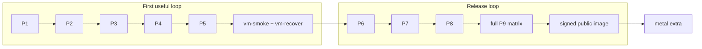

# AIOS Implementation Design Plan

| Field | Value |
| --- | --- |
| Title | AIOS Implementation Design Plan |
| Author | Workstation implementer (Grok Build `/design`) |
| Date | 2026-08-23 |
| Status | Draft (two must-closes resolved by the human on 2026-08-23: version string = `/etc/os-release`; work-runtime = user unit. Still not `/execute` until the human says so.) |
| Spine | [docs/implementation.md](implementation.md) (P0–P11, L-01–L-23). This file expands that spine; it does not replace it. |
| Invariants | [docs/envelope/hard-invariants.md](envelope/hard-invariants.md) — quote by id. Do not extend. |
| Audience | Senior engineers implementing from `main`. Proposer never merges to `main`. |

---

## Overview

AIOS is an Arch Linux machine a privileged systemd service maintains so the human does not administer it. Control is a living envelope of checkable conditions. Enactment is local git. Validation is a different process (the checker), not the model asked again. The specification on `main` is complete. There is no implementation code yet. This document is the `/design` expansion of [docs/implementation.md](implementation.md): the same phase IDs **P0–P11**, the same locks **L-01–L-23**, the same units, views, schemas, and oracles — written so an engineer can execute phase by phase without inventing a parallel architecture.

The first executable slice is **P1**: a signed-shaped archiso payload that installs a minimal Arch (no desktop, no `-Syu`, both kernels) and reaches a TTY installer in QEMU. Public release is **P11** (signed image + full VM matrix). Bare metal (**P10**) is extra proof after that. The optional work runtime is default off (HI-15) and is not synthesised in the ISO.

---

## Background & Motivation

`main` already names every product surface v1 will ship: locks, phases, coverage table, HI→oracle map, v1 holes, future code trees, units, and schemas. Seeds for the work runtime and bots extension exist as contracts, not deployments. Code trees (`payload/`, `agent/`, `checker/`, `installer/`, `intent/`, `operator-client/`, `tests/vm/`) are created when their phase starts.

Without this expansion, an implementer is forced to invent: a first-week “MVP ISO,” extra daemons, a desktop, a default-on work runtime, or a merge-to-main habit. Those are how the box bricks or how the project becomes a teammate product. This design exists so `/execute` of **P1 only** can start after human approval, with files, units, oracles, and must-closes already named in the spec.

Inspired systems (Grok Build, InsideMan/Grokbot) are **reference points**. Transfer the closed loop and named structure already in the AIOS spec. Do not copy personhood, identity stores, channels-as-kernel, avatars, or a two-computer teammate product.

---

## Goals & Non-Goals

### Goals

A stranger can download a **signed** archiso payload, verify it out of band, boot a VM, answer two questions, and have a machine that satisfies HI-01…17.

1. Verifies itself and the target machine.
2. Installs a minimal Arch (btrfs, snapper, systemd, git, pacman) with **no desktop**.
3. Drops a TTY **definition surface** that *is* the installer (L-18 views).
4. Compiles the first envelope from two questions (purpose; work-runtime opt-in) plus vetoes. Creates one operator login (L-13).
5. Leaves a reconstructible `/srv/aios` whose privileged agent proposes and whose checker, a different process, enacts (HI-01, HI-02, HI-03).
6. If work-runtime was yes: every transferred user-work surface has a green oracle. If no: no work units (HI-15).
7. The payload contains no secrets and no PII. Known limitations are listed. Graphical operator clients are not in the image.

### Non-goals (v1 holes — do not implement)

Copied from the spine so they are not accidental omissions:

| Hole | Status |
| --- | --- |
| Graphical operator client in the payload | Out. TUI is v1. Same view ids later. |
| In-place OS upgrade | Out. Reconstruct from payload + git. |
| Multi-operator / multi-seat | Out. One login (L-13). |
| Default LUKS on the VM image | Out. Asked on metal (P10), not implied. |
| Paid live API in CI | Out. Fixture covers oracles. |
| Bots enabled by work-runtime yes | Out. Second envelope bit, default off (P8.13). |
| InsideMan identity, channels, desktops-as-screens, personhood | Never without an envelope rewrite. |

Also out: a new language runtime; a memory product; DE/WM lock-in; privileged work agents; rewriting the kernel; AUR as the default path; a parallel phase list (P1a, “MVP ISO”, “week 1 sprint”).

---

## Key Decisions

Changing a lock is a docs patch to [docs/implementation.md](implementation.md) first, then human approval — not a surprise in code.

### L-01…L-23 (restated)

Canonical table remains [docs/implementation.md](implementation.md) “Locked decisions”; this is a copy. Any lock change is a spine patch first, then this restatement. L-01…L-21 were locked before 2026-08-23; L-22 and L-23 are the 2026-08-23 human locks.

| ID | Decision | Rationale (why this lock exists) |
| --- | --- | --- |
| L-01 | Python 3 (Arch `python`) + POSIX `sh` oracles. No third-party Python deps in v1. No new language. | HI-12. Checker stays boring. Work runtime, once synthesised, is the same language. |
| L-02 | Uids `aios-agent`, `aios-checker`, `aios-work`. Separate. No shared supplementary group that can write privileged trees. | HI-02, HI-16. Privilege is an OS property. |
| L-03 | Bare git checker-owned. Agent pushes only `refs/heads/agent/*`. No proposer `main`, no force-push. | HI-01, HI-02, HI-03. |
| L-04 | Only root path: `/usr/lib/aios/bin/enact`. Full `-Syu` window, snapper, ESP copy, `bootctl`, `aios-*` units. Partial `pacman -S` is not allowlisted. | HI-04, HI-06. Mixing research and pacman is how the box bricks. |
| L-05 | `/run/aios/intent.sock` via `aios-intent.socket`. `SOCK_STREAM`. One JSON object, then close. Mode `0660`, owner `aios-agent`, group `aios-work`. Not a shell. | HI-13. |
| L-06 | Work slice: system slice caps any system-level work cgroup; L-23 user units carry `MemoryMax`/`CPUQuota`/`NoNewPrivileges`/`ProtectSystem`/`InaccessiblePaths` on the **user** unit. `User=` implied by the `aios-work` user manager. | HI-13, HI-16. Denial is the kernel. |
| L-07 | 32G qcow2 GPT. 1G ESP vfat `/boot` **not in btrfs**. Rest btrfs: `@` `/`, `@home` `/home`, `@srv` `/srv`, `@var_log` `/var/log`, `@snapshots` `/.snapshots`. zram swap. Snapper of `@` does not include ESP or nested subvolumes. | Arch Wiki Snapper suggested layout + Installation guide UEFI GPT example. HI-06: snapper-alone on this layout is a false seatbelt. |
| L-08 | Provider: `fixture` (VM default) and `live`. Checker imports no provider. | HI-08. Tests never require a paid API. |
| L-09 | First surface: TTY TUI. ISO getty → firstboot; disk installer owns `/dev/console` until P5 accept; then operator getty autologin. Not enabled on the live ISO. No display manager. Views are L-18. | Bootstrap constraint: payload is less free than the running system. |
| L-10 | minisign. Unsigned images do not leave the workstation. | HI-04. |
| L-11 | Until envelope: UTC, `en_US.UTF-8`, hostname `aios`. | Deterministic firstboot. Envelope may change later as ordinary proposals. |
| L-12 | `aios brake`: stop+mask proposer, freeze enact, write `/srv/aios/state/brake`. Human-only. Installer stays up. | HI-05, human emergency brake. |
| L-13 | One non-root operator login. No sudo to enact. Service uids `nologin`. Root is recovery only. | v1 hole: multi-operator. |
| L-14 | OS surface ≠ work surface. One chat with both rights is a fail. | Mixing privilege into chat is how the kernel boundary dies. |
| L-15 | Work write set named before any work unit. Slice `ReadWritePaths` equals that set plus tmp. Floor until P8.2: `/srv/aios/src/work-runtime` only. | Shipping P8 while the slice only writes the work-runtime tree *and* claiming `~/src` is a fail. |
| L-16 | Work token ≠ OS token. Work uid cannot read the OS key. | Two providers, two files. |
| L-17 | Live Grok login is device-code (`grok login --device-auth`). URL + user code on TTY; finish on a phone or other PC. After accept. No pasted API key. | No DE in v1. Token `0600`, not in git or transcript. |
| L-18 | Named TUI views. GUI later is the same ids. Keyboard-complete. Clickable URLs when the terminal allows. | Grok Build TUI transferred as *client class*, not as the OS. |
| L-19 | Boot seatbelts: `linux` **and** `linux-lts`; `kernel-modules-hook`; `snap-pac`; systemd-boot generations; ESP copy in the **same** `enact` window as snapper post. TUI rollback, not live USB. Partial upgrades fail. | HI-06. Wiki: ESP is not in btrfs snapshots; `snapper rollback` of `/` is not this layout’s path. |
| L-20 | Two harnesses. **A** payload/firstboot: pinned, no model, **no `-Syu`**, seatbelts before questions. **B** in-OS agent: plan (wiki/man this turn) → accept → `enact` once → verify without the model → stall pause. `enact` does not curl. Mixing is a fail. | Firstboot that syncs the world installs “today’s broken mirror” onto a box you cannot yet reconstruct. |
| L-21 | Agent always *available*, idle by default. Event-driven + bounded upgrade. Same-gap twice or infra → pause. Corrupt goals restore **paused**, never self-driving. | Grok Build Goal mode stall, transferred as harness behaviour. Not an always-proposing hobbyist. |
| L-22 | Version string: `/etc/os-release` (and `/usr/lib/os-release`) `NAME`/`VERSION`/`VERSION_ID`. | Human lock 2026-08-23. firstboot writes; P1/P11 oracles grep. |
| L-23 | Work runtime and bots: systemd **user** units at `/usr/lib/systemd/user/`. OS agent/checker/installer stay system units. | Human lock 2026-08-23. User tasks (HI-15, L-14), not OS admin. Do not ship both. |

### Must-closes: answered now vs deferred

**Answered now (already locked in the spine; this design restates, does not reopen):**

- Language, uids, git, enact, socket, slice, disk, provider, TUI-first, minisign, locale-until-envelope, brake, one operator, two surfaces, floor write set, two tokens, device-code, view catalog, seatbelts, two harnesses, idle/stall (L-01…L-21).
- **Version string (L-22):** `/etc/os-release`. Human 2026-08-23.
- **Work-runtime unit (L-23):** user unit at `/usr/lib/systemd/user/`. Human 2026-08-23.
- P1 installed package set (see First `/execute` session).
- Bare repo names (P2 list).
- Socket path/mode/owner (L-05).
- Bots is **not** a first-envelope question.
- Graphical clients stay a v1 hole.
- Named units and named views only.

**Deferred — close at the named phase. Options in [Open Questions](#open-questions). Do not silently pick:**

| Question | Close in |
| --- | --- |
| Pinned Arch bootstrap tarball URL + sha256 | **P1, first hour** |
| Exact live OS token path | **P4.2 locked:** `/srv/aios/state/provider/os.token` |
| When a pattern earns a `SKILL.md` | **P4.3 locked:** two successful verbatim moments of the class, or the human asks. |
| Operator username: asked vs derived | P5 |
| How summon names the surface | P7 |
| L-15 write set vs `~/src` | P8.2 |
| How bots is asked | P8.13 |
| LUKS / Secure Boot | P10 |
| How the checker marks hardware-specific commits inapplicable | P10.2 |
| Version scheme; where the public key lives out of band | P11 |

Do not synthesise work-runtime “while we are in the ISO.” P8 still does not *enable* a unit until the matching drop-in lands (PR 32); the unit *type* is already locked.

---

## Proposed Design

The body of this design is the phase expansion. Architecture is already in [docs/architecture.md](architecture.md). This section sequences work so **P1 is independently bootable in QEMU without P8**.



### Two harnesses (do not mix)

| | Harness A | Harness B |
| --- | --- | --- |
| When | Payload / firstboot (P1, P2 materialisation, P5 conversation) | After envelope accept (P4+) |
| Model | Not required | Allowed (`fixture` in VM; `live` after accept, L-17) |
| `-Syu` | **Forbidden** | Full `-Syu` window only, one intent, via `enact` |
| Research | Done when building the ISO. Pin the bootstrap tarball. | Wiki/man **this turn**, in plan only |
| `enact` | Does not exist yet as a live path (binary may be installed) | Once per accepted plan. Does not curl |
| Recovery | `bootstrap-in-progress` + `snapper_pre` | Stall pause + TUI rollback (L-19, L-21) |

Mixing them (ISO that syncs the world, or agent that pacmans while thinking) is how the box bricks (L-20).

### Order of proof (do not skip)

```
payload boots TTY
  → skeleton + seeds local
    → checker refuses bad proposals
      → agent proposes under git
        → installer compiles first envelope (recoverable)
          → kernel denies work-slice privilege
            → summon/notify on TTY (OS surface)
              → optional work-runtime: every transferred surface
                → QEMU matrix green (including work-yes and work-no)
                  → signed public artifacts
                    → bare metal
```

**First useful loop:** P1–P5 + `vm-smoke` + `vm-recover`.

**Release loop:** that, plus P6–P8, full P9, P11. Metal is extra.

**Public release means P11 green**, including every P8 surface if the image claims work-runtime. Shipping without P8.14 green is not a release. Cutting P8 to “seed copied, unit started” is a fail.

---

### P0 — Source of truth

**Goal.** The tree implementation grows from is the current spec tip, and the spine already names every product surface that v1 will ship.

**Depends.** Human merge of the docs stack. Proposer does not merge to `main` (HI-03).

**Done.** An implementer can clone the spec tip and know, for every surface, which phase accepts it and which oracle fails if they skip it.

**Must-close.** None left open: L-01…L-23 and the coverage table are the closures. A new daemon that is not in the units list is a docs patch first (HI-12). A new view that is not in L-18 is a docs patch first.

| WP | Title | Delivers |
| --- | --- | --- |
| P0.1 | Keep the spec tip current | `main` remains the complete spec until implementation PRs land. |
| P0.2 | Name the implementation trees | payload, agent, checker, installer, intent, operator-client, tests/vm. |
| P0.3 | Lock implementer decisions | L-01…L-23. Code that contradicts them is a docs patch first. |
| P0.4 | Coverage | Every v1 surface has a phase and an oracle in the spine. |

**Files and units.** Spec docs and seeds already in this repository. No new daemons.

**Harness.** Neither. Docs only.

**Oracles (already true on `main`; re-run after any docs PR):**

```sh
test -f docs/envelope/hard-invariants.md
test -d seed/work-runtime && test -d seed/work-runtime-bots
grep -q 'P0–P11' README.md
# Coverage table in docs/implementation.md has a row for every transferred work-runtime surface.
```

**Rollback.** Git revert of the docs PR. No snapper (no machine yet).

**Risks.** A later phase invents a daemon or view. **Mitigation:** HI-12 / L-18; checker `hi-12-named-daemons.sh` from P3.

---

### P1 — Trusted payload

**Goal.** An archiso-shaped image that verifies itself and the machine, then installs a minimal Arch with no desktop.

**Depends.** P0.

**Done.** A QEMU VM boots the image to a TTY installer prompt. The payload is smaller and less free than the running system. It is fit to become the public artifact after later phases, not a throwaway demo ISO.

**Harness.** **A.** No model. No `-Syu`. Seatbelts before questions. Research for this phase was fetched this turn (Archiso, Installation guide, systemd-boot, Snapper, Pacman, System maintenance, snap-pac(8), kernel-modules-hook package). Do not fetch wiki during firstboot.

#### Must-close

| Question | Answer in this design |
| --- | --- |
| What the image must not contain | Locked: secrets, PII, DEs (`hyprland`, `gnome`, `plasma`, `sddm`, `gdm`), enabled `sshd`. `openssh` package **present and disabled**. |
| Installed package set | Locked file: `payload/profile/pacstrap.x86_64` (see First `/execute`). firstboot and P1 oracles both read **this** file. |
| Disk confirmation (unattended vs TTY) | **Closed for P1.** Product path: TTY confirm of the candidate disk. `tests/vm`: ISO cmdline `aios.firstboot=auto` proceeds only if exactly one candidate disk. Refuse (no partition) if more than one candidate unless confirmed on TTY. |
| Pinned Arch bootstrap tarball URL + sha256 | **Close in the first hour of `/execute` P1.** Procedure and options: [Open Questions](#open-questions). Do not follow “latest”. |
| Version string location | **Locked (L-22, human 2026-08-23).** `/etc/os-release` and `/usr/lib/os-release`: `NAME`, `VERSION`, `VERSION_ID`. firstboot writes; P1/P11 oracles grep. |
| `man-db` / `man-pages` on the locked list | **Closed:** wiki URL this turn is sufficient for P4.6. Local `man` is optional when those packages exist later. Do not add them to the P1 locked list. |

#### Work packages

| WP | Title | Delivers |
| --- | --- | --- |
| P1.1 | archiso profile | `payload/profile` with the ISO live set + firstboot pacstrap list. |
| P1.2 | Self-verify | Checksum + minisign; out-of-band steps in `payload/README.md`. Unsigned images must not leave the workstation. |
| P1.3 | TTY firstboot | getty autologin → `/usr/lib/aios/bin/firstboot`. No display manager. Serial autologin for QEMU. |
| P1.4 | Pinned blobs | `payload/hashes.txt` for agent, checker, installer, seeds, HI file, enact, sysusers, units, **`pacstrap.x86_64`**. Stubs allowed; hashes still pin whatever is shipped. |
| P1.5 | Clean image | No secrets, no PII, sshd disabled, no DE. |

#### Files and units (only named trees)

Created in this phase (from “Future code trees”):

```
payload/
  README.md
  build.sh
  hashes.txt
  minisign.pub
  profile/
    profiledef.sh
    packages.x86_64                 # live ISO set
    pacstrap.x86_64                 # installed set; firstboot + oracles
    pacman.conf
    bootstrap_packages.x86_64
    airootfs/
      etc/systemd/system-generators/   # empty / unused in v1 (HI-12: no generator)
      etc/systemd/system/getty@tty1.service.d/autologin.conf      # LIVE ISO only
      etc/systemd/system/serial-getty@ttyS0.service.d/autologin.conf
      etc/systemd/system/aios-installer.service   # unit file present; NOT enabled on ISO
      usr/lib/aios/bin/firstboot
      usr/lib/aios/bin/enact          # installed; not used as live path yet
      usr/lib/aios/bin/installer      # stub TTY prompt
      usr/lib/aios/pacstrap.x86_64    # same bytes as profile/pacstrap.x86_64; hashed
      usr/lib/aios/bin/agent          # stub / pin only
      usr/lib/aios/bin/checker        # stub / pin only
      usr/lib/aios/bin/aios           # stub
      usr/lib/sysusers.d/aios.conf
      usr/lib/tmpfiles.d/aios.conf
      srv/aios/seeds/                 # copied in, already git
```

**No `aios-firstboot.service`.** That unit is not in the units table (HI-12). **`system-generators/` is empty / unused in v1** (copied so P1.4 hashes do not wait on a surprise generator).

**Console ownership (one installer unit; two named boot entries — not two daemons):**

The installer binds **`/dev/console`**. Last `console=` on the kernel command line **is** `/dev/console`. One options line cannot make that both the VT and ttyS0. **Do not** add `aios-installer-serial.service` (HI-12). Named systemd-boot `.conf` files are boot entries, not units.

| Loader entry | `console=` (last = `/dev/console`) | Who uses it |
| --- | --- | --- |
| `aios-linux.conf` / `aios-linux-lts.conf` (**shipped default**) | `console=tty0` only | Metal, virt-manager, P10/P11 payload. Display VT hosts the installer. |
| `aios-linux-serial.conf` / `aios-linux-lts-serial.conf` | `console=tty0 console=ttyS0` | `tests/vm/qemu.sh` (`-display none -serial stdio`). |

`loader.conf` `default` is `aios-linux.conf`. qemu.sh does **not** use DMI `QEMU` to pick serial (virt-manager is also QEMU). The harness passes `-fw_cfg name=opt/org.aios/console,string=serial` on the **live ISO**; firstboot then `bootctl set-default aios-linux-serial.conf` so the disk reboot is serial. Public ISO / metal omit that fw_cfg.

| Environment | Who owns the definition TTY | How |
| --- | --- | --- |
| **Live ISO** | `firstboot` via getty | `getty@tty1` / `serial-getty@ttyS0` autologin. `aios-installer.service` is **not** enabled (no `multi-user.target.wants` symlink on the ISO). |
| **Installed disk (until P5 accept)** | `aios-installer.service` only | `TTYPath=/dev/console`, `StandardInput=tty`, `StandardOutput=tty`, `Conflicts=getty@tty1.service serial-getty@ttyS0.service`, `Restart=on-failure`, `ExecStart=/usr/lib/aios/bin/installer`. firstboot `systemctl enable`s this **inside the chroot**, not in airootfs. |
| **Installed disk (after P5 accept)** | operator autologin on the **same consoles** | Disable/stop installer; `getty@tty1` **and** `serial-getty@ttyS0` autologin as the operator (metal tty0 / QEMU serial). |

Live ISO getty (not a product root shell):

```
# airootfs/etc/systemd/system/getty@tty1.service.d/autologin.conf
[Service]
ExecStart=
ExecStart=-/usr/bin/agetty --noreset --noclear --autologin root --login-program /usr/lib/aios/bin/firstboot --login-options '-' - ${TERM}
```

Serial (QEMU `-serial stdio`):

```
# airootfs/etc/systemd/system/serial-getty@ttyS0.service.d/autologin.conf
[Service]
ExecStart=
ExecStart=-/usr/bin/agetty --noreset --noclear --autologin root --login-program /usr/lib/aios/bin/firstboot --login-options '-' --keep-baud 115200,57600,38400,9600 - ${TERM}
```

Wiki (Archiso, fetched this turn):

- Copy a profile from `/usr/share/archiso/configs/{releng,baseline}` to a writable dir. **Start from `releng`** (official monthly ISO; BIOS+UEFI isohybrid) and strip, rather than invent a third profile.
- Structure: `packages.x86_64`, `airootfs/`, `profiledef.sh`, `pacman.conf`.
- Build: `mkarchiso -v -r -w /tmp/archiso-tmp -o out_dir profile_dir`.
- systemd-boot config lives in `efiboot/loader`; syslinux in `syslinux`.
- Multiple kernels: edit `packages.x86_64`; mkarchiso includes all `vmlinuz-*` and `initramfs-*.img`.
- Getty autologin: `airootfs/etc/systemd/system/getty@tty1.service.d/autologin.conf`.
- Serial (QEMU `-serial stdio`): `serial-getty@ttyS0.service.d/autologin.conf` with `--keep-baud 115200,57600,38400,9600`.
- Enable units by creating the same symlinks `systemctl enable` would create.
- `file_permissions` in `profiledef.sh` for `/etc/shadow` etc.
- `run_archiso` exists; AIOS uses the floor QEMU invocation in implementation.md (`-serial stdio`, `-display none`).

**ISO live set vs installed set.** `packages.x86_64` is the live ISO. It contains everything in `pacstrap.x86_64` **plus** the minimum to boot the live installer and run firstboot (`arch-install-scripts` for `pacstrap`/`genfstab`/`arch-chroot`, `dosfstools`, `gptfdisk`, archiso/mkinitcpio-archiso bits required by releng). Firstboot runs `pacstrap -K /mnt` with **exactly** the lines in `payload/profile/pacstrap.x86_64`. Do not add DEs, AUR helpers, or a desktop. Do not add packages to `pacstrap.x86_64` without a docs patch.

**Releng strip (live ISO).** Start from `releng`, then:

- Replace getty ExecStart as above so autologin runs `firstboot`, not a product root shell / zsh.
- Do **not** enable on the ISO: `display-manager.service`, `sshd.service`, `aios-installer.service`, `reflector.timer` if present, cloud-init units if present.
- `openssh` may be in the live set; `sshd.service` stays disabled.
- Live ISO may keep systemd-networkd/resolved/iwd as releng does (Installation guide: that is the *live* environment). The **installed** system gets the Harness A network files firstboot writes (below) — releng’s live network is not copied as undeclared disk state.

#### Firstboot sequence (Harness A)

Wiki (Installation guide, systemd-boot, Snapper, fetched this turn):

1. UEFI boots the ISO. `firstboot` verifies `hashes.txt` and the minisign signature **before touching disks**.
2. Probe firmware and disks. Candidate disks exclude the ISO, `rom`, `loop`, `airootfs`. **Confirmation:** TTY lists candidates and waits, unless auto is set (qemu.sh `-fw_cfg name=opt/org.aios/firstboot,string=auto`, or cmdline `aios.firstboot=auto`). Auto proceeds only if there is **exactly one** candidate. `aios.firstboot=confirm` forces TTY. More than one candidate without TTY confirm → exit non-zero, do not partition. Public ISO does not bake auto into loader entries.
3. Partition GPT per L-07: 1 GiB ESP, type EFI System, rest Linux filesystem. `mkfs.fat -F 32` on ESP. `mkfs.btrfs` on remainder. Create subvolumes `@`, `@home`, `@srv`, `@var_log`, `@snapshots`. Mount `@` at `/mnt`, ESP at `/mnt/boot`, others at their mount points (`--mkdir`).
4. `pacstrap -K /mnt $(grep -v '^#' /usr/lib/aios/pacstrap.x86_64)`. That on-ISO path is **locked** (same bytes as repo `payload/profile/pacstrap.x86_64`; hashed in `payload/hashes.txt`). Including **both** `linux` and `linux-lts`. **Do not `-Syu`.** Do not `pacman -Sy pkg`.
5. `genfstab -U /mnt >> /mnt/etc/fstab`. `arch-chroot -S /mnt` (systemd mode so `bootctl` can write EFI vars when applicable). `bootctl install` with ESP at `/boot`. QEMU must provide OVMF so EFI vars exist; fail closed if firmware is missing.
6. systemd-boot entries (paths relative to ESP root):

```
# /boot/loader/entries/aios-linux.conf  (shipped default — VT /dev/console)
title   AIOS (linux)
linux   /vmlinuz-linux
initrd  /initramfs-linux.img
options root=UUID=<root-uuid> rootflags=subvol=@ rw console=tty0

# /boot/loader/entries/aios-linux-lts.conf
title   AIOS (linux-lts)
linux   /vmlinuz-linux-lts
initrd  /initramfs-linux-lts.img
options root=UUID=<root-uuid> rootflags=subvol=@ rw console=tty0

# /boot/loader/entries/aios-linux-serial.conf  (tests/vm only as default)
title   AIOS (linux, serial)
linux   /vmlinuz-linux
initrd  /initramfs-linux.img
options root=UUID=<root-uuid> rootflags=subvol=@ rw console=tty0 console=ttyS0

# /boot/loader/entries/aios-linux-lts-serial.conf
title   AIOS (linux-lts, serial)
linux   /vmlinuz-linux-lts
initrd  /initramfs-linux-lts.img
options root=UUID=<root-uuid> rootflags=subvol=@ rw console=tty0 console=ttyS0
```

Prefer `subvol=@` over `subvolid=` (Btrfs wiki: subvolid may change on restore). `bootctl set-default aios-linux.conf` unless fw_cfg `opt/org.aios/console` is `serial`.

7. Enable snap-pac hooks (package install is enough; they fire on every pacman transaction). `kernel-modules-hook` is the official Arch package ([extra/kernel-modules-hook](https://archlinux.org/packages/extra/any/kernel-modules-hook/)); there is **no** Arch Wiki page titled Kernel-modules-hook — cite the package. Enable `snapper-timeline.timer` / `snapper-cleanup.timer` only after snapper config exists (P2 may complete config; P1 must leave packages installed).
8. Copy seeds, HI file, sysusers, tmpfiles, `enact`, installer stub. systemd-sysusers. Hostname `aios`, UTC, `en_US.UTF-8` (L-11). Write `/etc/os-release` and `/usr/lib/os-release` (L-22) with `NAME`, `VERSION`, `VERSION_ID` (version value still from the P11 scheme when tagged; P1 may use a development string firstboot greps).
9. **Inside the chroot only:** `systemctl enable aios-installer.service` (`TTYPath=/dev/console`; `Conflicts=getty@tty1.service serial-getty@ttyS0.service`). Do **not** enable it on the live ISO. `openssh.service` disabled. No display-manager symlink.
10. Network (Harness A payload physics, not an envelope question): write DHCP `.network` and enable `systemd-networkd` + `systemd-resolved` (already in `systemd`). Leave `iwd` installed but **not** the Ethernet path; wireless is a later envelope proposal. Example:

```
# /etc/systemd/network/20-wired.network
[Match]
Name=en* eth*
[Network]
DHCP=yes
```

11. zram (L-07, P1, not deferred): `pacstrap.x86_64` includes `zram-generator` (official; persists without an unnamed `aios-*` unit). firstboot writes `/etc/systemd/zram-generator.conf` (`[zram0]` / `zram-size = ram / 2`). Metal may add a swap **partition** (P10); that does not replace zram on the VM image.
12. Reboot to disk. ISO is not needed after that for the TTY prompt. Disk boot is **UEFI** (systemd-boot); QEMU uses OVMF pflash, not SeaBIOS.

**ESP copy tool:** `cp -a` from `coreutils` (in `base`). Do **not** call `rsync` (not on the locked list). Wiki System backup hooks `Depends = rsync`; AIOS copies kernel/initramfs with `cp -a` inside `enact` / firstboot.



#### Oracles (fail-closed)

P1 does not yet own the full `vm-*` matrix (P9). These commands must be executable from the workstation harness and, once `tests/vm/qemu.sh` exists, wrapped as the start of `vm-smoke` / `vm-no-bootstrap-syu`.

```sh
# Image builds from a pinned Arch bootstrap (URL+sha256 closed in hour 1).
payload/build.sh
test -f dist/aios-*.iso

# minisign verifies (also a pre-boot step of vm-smoke). Unsigned ISO must not leave the workstation (L-10).
minisign -Vm dist/aios-*.iso -p payload/minisign.pub
grep -E '^[0-9a-f]{64} ' payload/hashes.txt

# No DE in the live ISO list OR the installed set.
! grep -Ei '^(hyprland|gnome|plasma|sddm|gdm)$' payload/profile/packages.x86_64
! grep -Ei '^(hyprland|gnome|plasma|sddm|gdm)$' payload/profile/pacstrap.x86_64

# Both kernels in the installed set (the list firstboot pacstraps) and the live ISO list.
grep -x linux payload/profile/pacstrap.x86_64
grep -x linux-lts payload/profile/pacstrap.x86_64
grep -x linux payload/profile/packages.x86_64
grep -x linux-lts payload/profile/packages.x86_64
grep -x zram-generator payload/profile/pacstrap.x86_64

# After disk boot (installed root):
grep -E '^(NAME|VERSION|VERSION_ID)=' /etc/os-release   # L-22
pacman -Q linux linux-lts openssh zram-generator
systemctl is-enabled openssh.service; test $? -ne 0
systemctl is-enabled aios-installer.service
systemctl is-active aios-installer.service
! systemctl is-active getty@tty1.service          # Conflicts= stops getty at runtime until P5 accept
! systemctl is-active serial-getty@ttyS0.service
bootctl list | grep -E 'aios-linux.conf|aios-linux-serial.conf'
# tests/vm (serial entry defaulted): disk-boot serial shows installer banner (-display none).
# Metal/display default entry: installer banner on the VT (P10 oracle).
swapon --show | grep zram
ip -4 route | grep -q default || networkctl | grep -E 'routable|configured'
! grep -- '-Syu' /var/log/pacman.log
# firstboot ran on the ISO; catch its journal from the ISO boot (saved) and/or
# the copy firstboot appends to the target:
! grep -- '-Syu' /var/log/aios-firstboot.log
# P5 also: installer conversation must not -Syu
! journalctl -u aios-installer.service -b | grep -- '-Syu'

# Seeds inside the profile (paths from repo root):
test -d payload/profile/airootfs/srv/aios/seeds/work-runtime
test -d payload/profile/airootfs/srv/aios/seeds/work-runtime-bots
```

`vm-no-bootstrap-syu` is all three greps: ISO `firstboot` journal (or `/var/log/aios-firstboot.log` copied onto the target), target `/var/log/pacman.log`, and `aios-installer.service` journal (P5). Pacstrap is not the installer unit.

Layout match (P1 done line, also P2): 1G vfat `/boot`; btrfs subvolumes named in L-07; zram swap active.

#### Rollback (P1)

No live system seatbelt yet. Failed firstboot must not leave a half-wiped disk as undeclared state: refuse before partition if verification fails; if partition started, the qcow2 is disposable (`work/aios.qcow2` is not committed). On metal this is why P10 is last.

L-19 does not yet have a snapper+ESP pair on the installed box until P2 completes snapper config and the first generation copy. P1 still **installs** the seatbelt packages so P2 can enable them.

#### Risks (P1)

| Risk | Severity | Mitigation |
| --- | --- | --- |
| Unpinned “latest” bootstrap | High | Must-close hour 1: URL + sha256 in `build.sh` and README. |
| ISO live set silently becomes the installed set (DEs, sshd on) | High | Two lists; oracles grep DE names; `openssh.service` disabled. |
| `-Syu` during firstboot | High | L-20; journal grep; no network refresh in firstboot script. |
| Only one kernel | High | Both packages explicit; `bootctl list` later (P2). |
| Inventing `aios-firstboot.service` | Medium | HI-12; autologin execs a binary. |
| Unsigned ISO copied off workstation | High | L-10; P1.2 before any image leaves. |
| Nested KVM missing | Medium | Workstation recipe assumes KVM; fail closed if `accel=kvm` unavailable. |
| Disk boot on SeaBIOS (no systemd-boot) | High | OVMF pflash required for disk boot; fail closed if firmware files missing. |
| firstboot blocked / wrong disk | High | TTY confirm, or `aios.firstboot=auto` with exactly one candidate. |
| No DHCP after disk boot | High | Harness A writes `.network` + enables networkd/resolved. |

---

### First `/execute` session (P1 only)

This section is the only work `/execute` may start after human approval of this design. Do not batch P2–P11. Do not synthesise the work runtime. Do not enable a desktop.

**Hour 1 — pin.** Close the bootstrap tarball question: choose option A or B from Open Questions, download once, record **URL + sha256** in `payload/build.sh` and `payload/README.md`. Version string is already locked (L-22): firstboot writes `/etc/os-release` (`NAME`/`VERSION`/`VERSION_ID`).

**Profile.** Copy `/usr/share/archiso/configs/releng` to `payload/profile/`. Replace `packages.x86_64` with the ISO live set (locked list + live-installer extras named above). Write `pacstrap.x86_64` as the installed set. `pacman.conf` stays official repos only. No custom AUR repo. Strip releng units as in P1.

**Locked installed set** — one file, `payload/profile/pacstrap.x86_64`, which firstboot and oracles both read (`pacstrap -K /mnt` of those names):

- `base`
- `linux`
- `linux-lts`
- `linux-firmware`
- `btrfs-progs`
- `snapper`
- `snap-pac`
- `kernel-modules-hook`
- `git`
- `python`
- `pacman`
- `systemd`
- `etckeeper`
- `minisign`
- `iwd`
- `sudo`
- `zram-generator`
- `openssh` present and **disabled**
- **no DE**
- **no `rsync`** (ESP copy is `cp -a`)

**Disk.** Partition L-07. systemd-boot. Both kernels. zram via `zram-generator`. DHCP `.network` + networkd/resolved. No `-Syu` in firstboot journal or `pacman.log`. ISO cmdline for qemu.sh: `aios.firstboot=auto`.

**TTY.** Live ISO: getty/`serial-getty` → `firstboot`. Installed disk: `aios-installer.service` owns **`/dev/console`** (`Conflicts=getty@tty1 serial-getty@ttyS0`). Shipped default entries: `console=tty0` (display VT). Serial entries: `console=tty0 console=ttyS0`; qemu.sh selects them via fw_cfg, not DMI. After P5 accept, operator autologin on tty1 **and** ttyS0.

**QEMU.** Isohybrid is a **USB/optical convenience** for the ISO. Nested KVM tests use **OVMF for both** the live ISO run (so `arch-chroot -S` + `bootctl` can write EFI vars) and the **disk** boot (systemd-boot, no syslinux on disk). Fail closed if KVM or firmware is missing. Do not switch v1 to GRUB.

Common Arch firmware paths (qemu.sh probes; first match wins):

- `/usr/share/edk2/x64/OVMF_CODE.4m.fd` + `OVMF_VARS.4m.fd`
- `/usr/share/edk2-ovmf/x64/OVMF_CODE.fd` + `OVMF_VARS.fd`

Copy the VARS template to `work/OVMF_VARS.fd` (not committed). Floor invocations (`tests/vm/qemu.sh`):

```
# Live ISO (firstboot). Isohybrid still boots under OVMF.
# fw_cfg is required for unattended disk confirm (tests/vm); omit it on a
# human box and firstboot waits on TTY confirm.
qemu-system-x86_64 \
  -machine q35,accel=kvm \
  -cpu host \
  -m 4096 \
  -smp 2 \
  -drive if=pflash,format=raw,readonly=on,file=${OVMF_CODE} \
  -drive if=pflash,format=raw,file=work/OVMF_VARS.fd \
  -drive file=work/aios.qcow2,if=virtio,format=qcow2 \
  -cdrom dist/aios-*.iso \
  -netdev user,id=n0 \
  -device virtio-net-pci,netdev=n0 \
  -fw_cfg name=opt/org.aios/firstboot,string=auto \
  -fw_cfg name=opt/org.aios/console,string=serial \
  -serial stdio \
  -display none \
  -no-reboot

# Disk boot (installer stub). No -cdrom. No firstboot fw_cfg.
# Serial TUI: firstboot already set-default aios-linux-serial.conf
# (from opt/org.aios/console=serial). Same OVMF VARS.
qemu-system-x86_64 \
  -machine q35,accel=kvm \
  -cpu host \
  -m 4096 \
  -smp 2 \
  -drive if=pflash,format=raw,readonly=on,file=${OVMF_CODE} \
  -drive if=pflash,format=raw,file=work/OVMF_VARS.fd \
  -drive file=work/aios.qcow2,if=virtio,format=qcow2 \
  -netdev user,id=n0 \
  -device virtio-net-pci,netdev=n0 \
  -serial stdio \
  -display none
```

firstboot treats auto as true if fw_cfg is `auto` **or** `/proc/cmdline` contains `aios.firstboot=auto`, **and** there is exactly one candidate disk. `aios.firstboot=confirm` forces the TTY even in a VM. More than one candidate disk always requires TTY confirm. Public ISO loader entries do **not** include `aios.firstboot=auto`.

fw_cfg `opt/org.aios/console=serial` (live ISO only) makes firstboot `bootctl set-default aios-linux-serial.conf`. Omit it on metal and display VMs so the default stays `aios-linux.conf` (`console=tty0`). Do not key this off DMI `QEMU` (virt-manager is QEMU with a display).

32G qcow2 at `work/aios.qcow2` (not committed). P1 invokes QEMU twice: ISO install, then disk.

**Stop when all of the following are shown:**

1. QEMU **disk-boot** serial (`-display none`) shows the installer banner (serial loader entry; not a DE, not a product root shell). `aios-installer.service` is active on `/dev/console`. Metal/display default entry is a separate oracle (P10: VT shows installer).
2. Layout matches L-07 (1G vfat `/boot`; btrfs `@` `@home` `@srv` `@var_log` `@snapshots`; zram in `swapon --show`).
3. `linux` and `linux-lts` are installed.
4. `/var/log/pacman.log` and firstboot log contain no `-Syu`.
5. Default IPv4 route exists (QEMU user-net DHCP).

Do not implement P2 git skeleton in this session beyond what firstboot must copy (seeds, HI file, sysusers) so P2 has local objects. Do not start `aios-agent.service`. Do not enable work units.

---

### P2 — Machine skeleton

**Goal.** After install, `/srv/aios` exists as git, seeds are local, snapper and etckeeper are on.

**Depends.** P1.

**Done.** A freshly payload-installed box has a reconstructible skeleton before any conversation.

**Harness.** **A** for anything firstboot still does (no `-Syu`). No agent loop yet.

#### Must-close

| Question | Answer |
| --- | --- |
| Bare-repo names | Already listed. Do not rename. |
| Operator home before login | `@home` exists as a subvolume even before the login is created. |
| Snapper on `@home` | **Closed (spine P2 deliverable, not omitted):** `snapper -c home create-config /home`. Nested `/home/.snapshots` under `@home` is the wiki default for that subvolume (home snapshots stay with `@home`; restoring `@` does not revert `@home`). Do **not** drop “and `@home`” from the spine. |

#### Work packages

| WP | Title | Delivers |
| --- | --- | --- |
| P2.1 | Disk and snapper | btrfs subvolumes + timeline + pre-enactment hook. |
| P2.2 | Git trees | Bare repos + worktrees + README + `.gitignore` + hook paths. |
| P2.3 | Seed materialisation | Copy payload seeds; verify offline. |
| P2.4 | Boot seatbelts | linux-lts, snap-pac, kernel-modules-hook, systemd-boot generations (L-19). |

#### Files and units

On the running machine (from architecture.md + units table):

```
/srv/aios/
  AGENTS.md
  envelope/          # worktree of envelope.git
    hard-invariants.md
  memory/ skills/ agent/ checker/ state/ seeds/
  etc-mirror/        # etckeeper remote of /etc (architecture.md)
/srv/aios/git/{envelope,memory,skills,agent,checker,state,seeds}.git
```

Hook templates may be empty until P3; the paths exist.

Wiki (Snapper, fetched this turn):

- `snapper -c root create-config /` then, for the suggested layout, delete the auto `.snapshots` subvol snapper created under `@` and mount `@snapshots` at `/.snapshots`.
- `snapper -c home create-config /home`. Keep snapper’s nested `/home/.snapshots` (subvolume of `@home`). Do not mount `@snapshots` there.
- Nested subvolumes (`@home`, `@srv`, `@var_log`) are **not** in a snapshot of `@`.
- Suggested layout matches L-07: `@` `/`, `@home` `/home`, `@snapshots` `/.snapshots`, `@var_log` `/var/log`. Also `@srv` → `/srv`.
- This layout is **not** intended for `snapper rollback` of `/` from a running system; wiki restore of `@` is live USB. AIOS v1 rollback is **TUI `snapper` view: previous ESP generation + matching `@`**, not live USB, not `snapper rollback`.
- Pre/post: `snapper create --type pre` / `--type post --pre-number`.
- Timeline via systemd timers (`snapper-timeline.timer`, `snapper-cleanup.timer`) if no cron.
- `linux` and `linux-lts` stay explicit; pacman db must stay on `@`.

Wiki (System backup § Snapshots and `/boot` partition):

- ESP is not in btrfs snapshots.
- Copy `/boot` on kernel update via pacman hooks (wiki uses rsync). **AIOS shape:** `cp -a` of `vmlinuz-linux`, `vmlinuz-linux-lts`, `initramfs-linux.img`, `initramfs-linux-lts.img` **inside the same `enact` window** as snapper post, recorded with **snapper id**, not a random timestamp dir as the only record. Do **not** copy `initramfs-*-fallback.img` into generations (1G ESP).
- `boot-seatbelt.sh` (P3) fails if the last snapper pair has no matching ESP generation.

ESP generation layout (data model; not a new daemon):

```
/boot/loader/entries/aios-linux.conf              # default; console=tty0
/boot/loader/entries/aios-linux-lts.conf
/boot/loader/entries/aios-linux-serial.conf       # console=ttyS0 last; tests/vm
/boot/loader/entries/aios-linux-lts-serial.conf
/boot/loader/entries/aios-prev.conf               # previous generation, once one exists
/boot/loader/entries/aios-rollback.conf           # VT or serial, matching how we booted
/boot/aios-gen/<snapper-post-id>/                 # four kernel/initramfs files
/srv/aios/state/esp-generations
```

**Retention N = 2 generation directories** plus the live files at ESP root: keep **current** (id of last snapper post) and **previous** (the one before that). `enact` in the same window deletes `/boot/aios-gen/*` not in that set. `boot-seatbelt.sh` needs current + previous after the first privileged `-Syu`; before any privileged change, current only is green.

systemd-boot can only launch EFI from the ESP it is on (wiki). Previous kernels therefore **live on the ESP**.

P2.4 first generation: after snapper config, `cp -a` the four kernel/initramfs files to `/boot/aios-gen/<id>/` and record the map. `aios-prev.conf` is absent until the second generation exists.

#### L-19 restore procedure (shared; not `undochange`; not live USB as the product path)

`aios-prev.conf` **only** changing `linux`/`initrd` while leaving `rootflags=subvol=@` boots new-or-old kernels against a **mutated** `@` — that is the HI-06 brick. Restore must move **ESP kernels and `@` together**. Snapper snapshots of `@` live at btrfs path `@snapshots/<id>/snapshot` (because `@snapshots` is mounted at `/.snapshots`). Those snapper snapshots are **read-only**; `rw` on the kernel command line does **not** clear `btrfs property ro`. **Do not boot the RO snapper snapshot as `/`.** Pacman db lives on `@`, so restoring that snapshot’s *content* restores the db with the files.

**P7.7 — failed Harness B `-Syu` (TUI `snapper` view, keyboard path):**

1. Operator selects the previous **successful** window. `N` is the previous **successful post** id in `esp-generations` that still has `/boot/aios-gen/<N>/` (last known-good). **Not** the failed window’s post id (that directory holds the broken kernels). **Not** a pre id (there is no `aios-gen/<pre>/`).
2. **Before reboot**, from the still-writable broken `@` (ESP is vfat, writable either way):
   - Mount toplevel `subvolid=5` at `/run/aios-btrfs`.
   - `btrfs subvolume snapshot` (read-**write**) `/run/aios-btrfs/@snapshots/<N>/snapshot` → `/run/aios-btrfs/@.restore-<N>`.
   - Write `/boot/loader/entries/aios-rollback.conf` (paths relative to ESP root):

```
title   AIOS rollback
linux   /aios-gen/<N>/vmlinuz-linux
initrd  /aios-gen/<N>/initramfs-linux.img
options root=UUID=<root-uuid> rootflags=subvol=@.restore-<N> rw console=tty0
```

   If `/proc/cmdline` has `console=ttyS0` last (serial fixture), write the same entry with `console=tty0 console=ttyS0` instead (or `aios-rollback-serial.conf`) so `/dev/console` stays serial. Same for linux-lts if that generation has lts files. `bootctl set-default` that rollback entry (or LoaderEntryOneShot). Do **not** use `snapper undochange`. Do **not** use `snapper rollback`. Do **not** set `rootflags=subvol=@snapshots/<N>/snapshot`.
3. Reboot. The machine is now running from the **RW** subvolume `@.restore-<N>`, not from `@`, and not from the RO snapper snapshot. That is why this is not “replace `@` while it is `/`” and not “boot a RO snapshot as `/`”.
4. After that boot, **promote** (still before handing the TTY back as “done”):
   - Mount toplevel `subvolid=5` at `/run/aios-btrfs`.
   - Rename `@` → `@.broken-<N>` (keep until the operator deletes it; record the name in `state/` so it is not undeclared).
   - Rename `@.restore-<N>` → `@` (running root follows the subvolume id; the name is now `@`).
   - fstab on that `@` still says `subvol=@` (prefer `subvol=` over `subvolid=`).
   - `cp -a` `/boot/aios-gen/<N>/{vmlinuz,initramfs}-linux{,-lts}*` back to `/boot/` (ESP root live files now match `@`).
   - Point `aios-linux.conf` / `aios-linux-lts.conf` at `/vmlinuz-linux` etc. with `rootflags=subvol=@` and `console=tty0`. Restore `aios-linux-serial.conf` with `console=tty0 console=ttyS0`.
   - `bootctl set-default aios-linux.conf` unless this boot was serial (`ttyS0` last), then `aios-linux-serial.conf`. Remove or ignore `aios-rollback.conf`.
5. Reboot into restored `@`. Box reaches TTY on `/dev/console` (VT on metal; serial on qemu.sh). `vm-boot-seatbelt` rollback path red-fails if step 3 boots the RO snapper snapshot, or if `N` is the failed post id, or if step 4 is skipped.

**P5 reject — Harness A envelope reject (no `-Syu`):** do **not** call this “snapper undo” or `undochange`. Read `snapper_pre` from `bootstrap-in-progress`. That id is the **snapshot source to clone** (`btrfs subvolume snapshot` RW of `@snapshots/<snapper_pre>/snapshot` → `@.restore-<snapper_pre>`), **not** an ESP generation key when no kernel/initramfs change exists. If Harness A did not change kernels (it must not `-Syu`), keep current ESP live files; still restore `@` via the RW clone + rename so the conversation is not undeclared live state. `packages.txt` after restore matches pre-conversation.

Live USB remains last resort (P10), not the v1 product path.

#### Oracles

```sh
# Network down: seeds contain work-runtime, work-runtime-bots, and hard-invariants (HI-17).
# Harness: qemu -nic none after install.
test -d /srv/aios/seeds/work-runtime
test -d /srv/aios/seeds/work-runtime-bots
test -f /srv/aios/envelope/hard-invariants.md

snapper -c root list
snapper -c home list
etckeeper vcs status   # clean after first commit
test -d /srv/aios/etc-mirror
swapon --show | grep zram

grep -x linux /srv/aios/state/packages.txt
grep -x linux-lts /srv/aios/state/packages.txt
bootctl list | grep -E 'linux|linux-lts'
# boot-seatbelt.sh lands in P3; P2 must leave the predicates true:
# both kernels installed; last snapper id has /boot/aios-gen/<id>/

git -C /srv/aios/git/envelope.git rev-parse main
diff -q /srv/aios/state/packages.txt <(pacman -Qqe)
```

`packages.txt` from `pacman -Qqe` (explicit packages only).

#### Rollback

P2 is still Harness A. Failed skeleton: re-run firstboot on a fresh qcow2. Once snapper config exists, `snapper_pre` from firstboot is the installer recovery id (P5).

#### Risks (P2)

| Risk | Severity | Mitigation |
| --- | --- | --- |
| Snapper’s auto `.snapshots` nested under `@` | High | Delete it; mount `@snapshots` at `/.snapshots` (wiki). |
| ESP copy only on `@` (timestamp dir under `/`) | High | Generations on the ESP, keyed by snapper id (L-19, HI-06). |
| GitHub fetch for seeds | High | HI-17; copy from payload. |
| Empty hook paths forgotten | Medium | Paths exist; P3 fills them. |

---

### P3 — Checker MVP

**Goal.** An independent, boring process that cannot be talked into a pass. No model in this unit.

**Depends.** P2.

**Done.** Privileged enactment is mechanically gated.

**Harness.** Neither A nor B yet for the checker — it is the gate Harness B will use. No provider import (L-08).

#### Must-close

| Question | Answer |
| --- | --- |
| Proposal schema location | `checker/aios_checker/schema.py`. `intent/schema.json` may wait until P6; the checker already rejects missing oracles (HI-10). |

#### Work packages

| WP | Title | Delivers |
| --- | --- | --- |
| P3.1 | Schema and unit | `aios-checker.service` + proposal JSON schema. |
| P3.2 | Git hooks | `update` / `pre-receive` / `reference-transaction` templates. |
| P3.3 | HI oracles | One script per invariant that can fail closed. |
| P3.4 | Secrets and PII | `secrets-scan.sh`, `pii-scan.sh`. |

#### Files and units

```
checker/
  AGENTS.md
  README.md
  aios_checker/{main.py,schema.py,merge.py}
  policy/
    hi-01-git-source.sh … hi-17-seeds-local.sh
    packages-drift.sh
    snapper-enabled.sh
    etckeeper-enabled.sh
    boot-seatbelt.sh
    no-partial-upgrade.sh
    no-curl-sh.sh
    work-slice.sh
    secrets-scan.sh
    pii-scan.sh
  hooks/{update,reference-transaction,pre-receive}
```

Unit: `aios-checker.service`, uid `aios-checker`. Merge gate: only the checker uid fast-forwards or squash-merges to `main`.

#### Oracles

```sh
# Empty oracle set → reject: checker/aios_checker/schema.py (HI-10); tests/vm/oracles/no-oracle-reject.sh
# Proposer cannot update main: checker/hooks/update + policy/hi-03-no-proposer-main.sh
# Stopping snapper rejected: policy/hi-06-seatbelts.sh + policy/snapper-enabled.sh
! grep -n provider checker/
policy/secrets-scan.sh
policy/pii-scan.sh
```

These become part of `vm-smoke` and `vm-secrets` / `vm-pii`. Script contract: exit 0 on pass, non-zero on fail, one-line reason on stderr. Checker re-runs without the model (HI-02, HI-08).

`no-partial-upgrade.sh` must catch this class (wiki Pacman + System maintenance + snap-pac(8)):

- Privileged `pacman -S` / `pacman -Sy pkg` without a full `-Syu` window.
- `IgnorePkg` of `linux` while the rest moves.
- After a file-level `snapper undochange` of an upgrade, the pacman **sync db** can be ahead of the files (snap-pac(8): pre hook runs after db sync). AIOS v1 rollback is **not** `undochange`; it is previous ESP generation + matching `@` (pacman db lives on `@`). The script still fails the undochange class if it ever appears.
- Harness A `-Syu` is also a fail (`vm-no-bootstrap-syu`).

`boot-seatbelt.sh`: both kernels present; modules dir for the running kernel exists; last snapper pair has matching `/boot/aios-gen/<id>/`; `bootctl list` shows current linux, linux-lts, and previous once a previous exists.

#### Rollback

Checker does not enact. A bad checker commit is refused by not merging to `main` (human + later self-check). No snapper required for checker-only patches until they land as privileged system files via `enact`.

#### Risks (P3)

| Risk | Severity | Mitigation |
| --- | --- | --- |
| Model client sneaks into checker | High | Import guard; HI-02 oracle. |
| `true` / `test -f` as purpose-level oracles | High | Oracle quality bar in agent-loop.md; HI-08. |
| Secrets in payload missed because scanner only covers `/srv/aios` | Medium | Run on payload tree and git (coverage row). |

---

### P4 — Privileged agent MVP

**Goal.** Always-*available* proposer, idle by default (L-21), with a defined uid, deny-list, and a fixture-able model adapter. The OS loop is complete even with no work runtime. **Harness B**, not Harness A.

**Depends.** P3.

**Done.** The machine can be administered by the agent under the checker without a human running pacman.

#### Must-close

| Question | Answer in this design |
| --- | --- |
| Live OS token path | **Locked (P4.2).** `/srv/aios/state/provider/os.token` (mode `0600`, uid `aios-agent`, directory `0700`, gitignored `/provider/`). `/srv/aios/state` is on work-slice `InaccessiblePaths`. Not `/etc/aios/` (etckeeper). Not `/home`. Not in git. Not in the transcript. Work token is a different file (L-16). |
| When a pattern earns a `SKILL.md` | **Locked (P4.3).** Two successful verbatim moments of that class in `/srv/aios/memory`, or the human asks on the definition surface. Promotion is a privileged proposal in `/srv/aios/skills`, reviewed by the checker for overlap and envelope contradiction. The proposing model does not curate the tree (HI-11). Nested `AGENTS.md` outranks a general skill in that tree. |
| Proposal schema field for wiki/man citations | Locked by spine: empty citations → reject pacman/systemd/btrfs/boot classes. |

#### Work packages

| WP | Title | Delivers |
| --- | --- | --- |
| P4.1 | Unit and uid | `aios-agent.service`, sysuser, deny-list, `enact`. |
| P4.2 | Provider adapter | Live + fixture. VM tests use fixture. Key not in git. |
| P4.3 | Loop + memory | Turn loop, skill load, verbatim ingest. |
| P4.4 | Machine goals | Idle default, events, bounded upgrade, stall pause (L-21). |
| P4.5 | Acquisition | Full `-Syu` window = commit + packages.txt + snapper + ESP (L-19). |
| P4.6 | Plan citations | Wiki/man this turn for pacman/systemd/boot. Empty → reject. |

#### Files and units

```
agent/
  AGENTS.md
  README.md
  pyproject.toml          # name only; stdlib, no deps
  aios_agent/
    loop.py
    triage.py
    skills.py
    memory.py
    provider/{base.py,fixture.py,live.py}
    intent_consume.py
    goals.py
```

Units: `aios-agent.service` (User=`aios-agent`). sudoers: `aios-agent ALL=(root) NOPASSWD: /usr/lib/aios/bin/enact`. `aios-work` has no sudoers line. Agent is not in `wheel`. Socket may land in P6; agent already refuses unknown writers.

Named Python modules are those in the spine. Do not add a language runtime or extra daemons.

#### Harness B loop



Wiki **or** man for pacman, systemd, mkinitcpio, fstab, bootloader **this turn** in the plan. v1 locked set does not include `man-db`/`man-pages`; a wiki URL fetched this turn satisfies P4.6. Local `man` is extra when those packages exist. `enact` does not curl (L-20). Research during `enact` is a fail.

Machine goals (L-21): event-driven repair; bounded sysupgrade window (full `-Syu`, one intent, linux-lts remains bootable, not mixed with feature work); reconstructibility; work-runtime synthesis **if the bit is set**. Idle is the default. Same-gap twice → pause, notify, offer TUI rollback. Infra error → pause. Corrupt goal state restores **paused**, never self-driving.

Software acquisition (wiki Pacman / System maintenance): never `pacman -Sy pkg`; never `pacman -S` on a stale sync; always full `-Syu` as one intent. `.pacnew` handling is Harness B plan, not Harness A.

`kernel-modules-hook` keeps the running kernel’s modules after `-Syu` so the live kernel is not instantly killed. snap-pac creates pre/post for every pacman transaction regardless of how pacman is invoked (snap-pac(8)); snapshot numbers go to the pacman log. AIOS still requires ESP copy in the **same** `enact` window — snap-pac alone does not copy `/boot`.

#### Oracles

```sh
policy/hi-03-no-proposer-main.sh
# Fixture no-oracle patch: tests/vm/oracles/no-oracle-reject.sh + schema.py
policy/hi-11-verbatim-memory.sh
id aios-agent | grep -v wheel
sudo -l -U aios-agent | grep -x '/usr/lib/aios/bin/enact'
policy/packages-drift.sh
policy/boot-seatbelt.sh
policy/no-partial-upgrade.sh
# Empty citations on pacman/systemd/boot: schema.py field citations
# Same-gap: tests/vm/oracles/vm-stall-pause.sh
# Corrupt/unknown goals file → paused; restart with empty events invents nothing:
#   tests/vm/oracles/vm-goals-idle.sh
# Work uid cannot read OS token: policy/hi-16-os-privilege.sh
```

These are `vm-smoke`, `vm-boot-seatbelt`, `vm-no-partial-upgrade`, `vm-stall-pause`, `vm-goals-idle`.

#### Rollback

Every privileged `enact`: snapper pre → transaction → snapper post + ESP copy keyed by post id → `packages.txt` commit. TUI rollback (P7.7) boots previous ESP generation + matching `@`. Stall pause offers that action; do not loop `-Syu`.

#### Risks (P4)

| Risk | Severity | Mitigation |
| --- | --- | --- |
| Agent pacmans while planning | High | L-20; enact allowlist; citations required. |
| Always-proposing hobbyist | High | L-21; idle default; stall pause oracle. |
| Token in git | High | secrets-scan; mode 0600; L-16. |
| Partial upgrade as “just install nvim” | High | L-04; `no-partial-upgrade.sh`. |

---

### P5 — Conversational installer

**Goal.** The TUI in **installer** mode compiles the first envelope from two questions plus an operator login, with recovery. Not a raw question script.

**Depends.** P4.

**Done.** A human can finish bootstrap in a VM inside the TUI. The box has someone to log in as. The same TUI becomes OS mode; it is not a throwaway wizard.

**Harness.** **A** during the conversation: **no `-Syu`** (L-20). Live Grok login is **not** during unsigned firstboot (L-17: after accept). Fixture can finish the two questions.

#### Must-close

| Question | Answer |
| --- | --- |
| Operator username | **Asked** (P5.4). Not derived from purpose. Skip/empty is not a username. `answers.json` key `operator`. |
| Bots | **Not** a first-envelope question. `answers.json` has no `bots` key, or `bots` is false. |
| Views | Installer uses L-18: `conversation`, `questions`, `envelope`, `accept`, `recovery`, `chrome`. |

#### Work packages

| WP | Title | Delivers |
| --- | --- | --- |
| P5.1 | Installer TUI | L-18 installer views via `aios-installer.service` (`TTYPath=/dev/console`). Same catalog as later OS. |
| P5.2 | Envelope compiler | Purpose + vetoes + work bit + HI file as the envelope view. |
| P5.3 | Recovery snapshot | `bootstrap-in-progress` + resume on boot + recovery view. |
| P5.4 | Operator login | One non-root user, no enact sudo (L-13). |

#### Files and units

```
installer/aios_installer/{main.py,questions.py,compiler.py,recover.py}
```

Unit: `aios-installer.service`, `Restart=on-failure`, `TTYPath=/dev/console`. After accept: installer stops; operator autologin on `getty@tty1` **and** `serial-getty@ttyS0`; `aios-agent.service` starts.

Questions: purpose; work-runtime opt-in; operator login name; vetoes (never-do, networks, remotes). Skipping work-runtime is not a yes. Default administer-only (HI-15).

Compiler always includes `/srv/aios/envelope/hard-invariants.md`. Human accept is the merge authority for layer one (HI-05). Checker merges the first envelope to `envelope` `main` under the human-accept record.

#### Oracles

```sh
# Kill installer mid-question; reboot; last accepted answers reappear.
#   tests/vm/oracles/vm-recover.sh
policy/hi-15-work-default-off.sh          # vm-work-no
# Reject envelope: restore @ to snapper_pre via L-19 restore procedure (P5 path),
# NOT undochange. packages.txt matches pre-conversation; ESP match if any.
#   tests/vm/oracles/vm-recover.sh (reject fixture)
! systemctl is-enabled display-manager.service
# After accept: operator autologin on tty1 and ttyS0 (same consoles as installer)
loginctl list-sessions
! sudo -U operator -n /usr/lib/aios/bin/enact
python -c 'import json,sys; a=json.load(open("/srv/aios/state/bootstrap-in-progress/answers.json")); assert a.get("bots") in (None, False)'
# Envelope view without chat scroll: tests/vm/oracles/vm-tui-keys.sh
! journalctl -u aios-installer.service -b | grep -- '-Syu'   # P5 half of vm-no-bootstrap-syu
```

`vm-recover` drives the kill/reboot path. `vm-smoke` is administer-only accept.

#### Rollback

Reject → L-19 restore procedure, **P5 path**: RW-clone `snapper_pre` (snapshot source, not an ESP key unless kernels changed). Do not call `snapper undochange`. Kill/reboot → resume from `/srv/aios/state/bootstrap-in-progress/` (HI-09). Brake is a **chrome action** (L-12), not an L-18 view: stop proposer, freeze writes; TTY stays.

#### Risks (P5)

| Risk | Severity | Mitigation |
| --- | --- | --- |
| Skip interpreted as work-runtime yes | High | Default false; oracle HI-15. |
| Raw question script instead of L-18 views | High | Envelope/recovery/accept are views. |
| `-Syu` during conversation | High | Harness A; `vm-no-bootstrap-syu`. |
| Login during unsigned firstboot | Medium | L-17 after accept only. |

---

### P6 — Privilege boundary

**Goal.** Work processes cannot enact. The kernel says no.

**Depends.** P3, P4. (Does not depend on P8 existing.)

**Done.** Privilege is an OS property. A future work runtime cannot accidentally become the OS agent.

**Harness.** B for any privileged response to an intent. Denial itself is systemd/kernel (HI-13, HI-16).

#### Must-close

| Question | Answer |
| --- | --- |
| Socket path, mode, owner | Already L-05. |
| Floor write set until P8.2 | Work-runtime tree only (`ReadWritePaths=/tmp /var/tmp /srv/aios/src/work-runtime`). |

#### Work packages

| WP | Title | Delivers |
| --- | --- | --- |
| P6.1 | intent.sock | Socket unit, record schema, agent consumer. |
| P6.2 | Work slice | `aios-work.slice` + drop-in for any work unit. |
| P6.3 | Denial oracles | Checker tests that attempt pacman from the slice and expect fail. |

#### Files and units

```
intent/schema.json
intent/README.md
```

Units: `aios-intent.socket` as specified in the spine; `aios-work.slice`; `aios-agent.service` has `Sockets=aios-intent.socket` and consumes the fd.

`enact` is not executable by `aios-work`. Work uid cannot write `/srv/aios/envelope`. Work uid cannot read the privileged provider key path.

sysusers and slice drop-in: **exactly** the floor text in implementation.md. P8.2 patches L-15 and that drop-in **together**.

#### Oracles → `vm-privilege-deny`

```sh
# tests/vm/oracles/vm-privilege-deny.sh
policy/work-slice.sh
policy/hi-16-os-privilege.sh
# From aios-work.slice: pacman -S fails as EPERM/capabilities, not “the model declined”.
# Same process can file a valid intent (intent/schema.json).
! sudo -u aios-work test -w /srv/aios/envelope
! sudo -u aios-work test -x /usr/lib/aios/bin/enact
```

Intent is not a shell. `source` is `work-runtime` or `work-runtime-bots`.

#### Rollback

Socket/slice are systemd units in git. Failed P6: revert unit files via checker-gated merge; snapper+ESP if `/etc` changed (etckeeper + L-19).

#### Risks (P6)

| Risk | Severity | Mitigation |
| --- | --- | --- |
| Intent socket is a shell | High | Schema; one JSON object; agent is only consumer. |
| Write set disagrees with L-15 at P8 | High | Floor until P8.2; same-commit patch. |
| Work uid in a group that can read OS token | High | L-02; L-16 oracle. |

---

### P7 — Operator client (TUI)

**Goal.** Summon and notify exist. The first client is the TUI (L-18). No DE required. Summon names **which** surface (OS vs work). GUI later is a restyle of these views, not a second app.

**Depends.** P5.

**Done.** The human can find OS work on a box with no desktop, see our objects as views, and cannot mix OS privilege into a work turn.

**Harness.** B for OS conversation after accept. Brake and notify are mechanical.

#### Must-close

| Question | Answer |
| --- | --- |
| How the operator names the surface | **Close when P7.1 starts.** Options: `aios` vs `aios work` vs a flag vs two commands. [Open Questions](#open-questions). |
| Graphical clients | Stay a v1 hole. |
| OS views from chrome | Every L-18 OS view reachable: `chrome`, `conversation`, `envelope`, `intents`, `notify`, `snapper`, `packages`, `login`. **`brake` is a required action on `chrome`**, not a view id ([desktop.md](desktop.md) L-18). Binary: `/usr/lib/aios/bin/aios brake` (L-12). Do not invent a `brake` view. |

#### Work packages

| WP | Title | Delivers |
| --- | --- | --- |
| P7.1 | Summon | TUI command that names OS vs work. |
| P7.2 | Notify | systemd failure → notify view → OS conversation. |
| P7.3 | Brake | `aios brake` in chrome; installer/TUI stays. |
| P7.4 | Surface split | Work summon is a different session (L-14). |
| P7.5 | OS views | L-18 OS catalog. Keyboard-complete. Clickable when possible. |
| P7.6 | Login view | L-17 device-code. URL + code. Token not in transcript. |
| P7.7 | Snapper rollback | Previous ESP generation + matching `@`. Keyboard path. Not a live USB. |

#### Files and units

```
operator-client/tty/{aios.py,notify.py}
/usr/lib/aios/bin/aios     # summon / brake / status
```

No new daemon. No key chord in the OS contract (chords belong to an installed graphical client later).

HI-14 payload (five names): unit or executable; journal slice since last healthy; last related state commit; snapper id; matching envelope clause (and skill path if any). `policy/hi-14-failure-handoff.sh`.

Work summon with envelope bit off is refused with a reason (`vm-work-no`). If on, it opens work views, not OS tools (L-14).

Wiki (Snapper + systemd-boot): rollback is **not** `snapper rollback` from a running system on this layout. TUI action: [L-19 restore procedure](#l-19-restore-procedure-shared-not-undochange-not-live-usb-as-the-product-path) (P7.7 path). Box reaches TTY.

#### Oracles

```sh
# tests/vm/oracles/vm-notify.sh — dummy unit fail → HI-14 payload; notify + OS conversation
policy/hi-14-failure-handoff.sh
# Summon OS opens envelope + memory + OS skills + privileged tools.
policy/hi-15-work-default-off.sh          # work summon refused if bit off
# No key chord hard-coded into the OS contract.
# tests/vm/oracles/vm-brake.sh — aios brake (chrome action) masks proposer; TUI stays
# tests/vm/oracles/vm-tui-keys.sh — envelope/snapper/packages without chat scroll; keys only
# tests/vm/oracles/vm-boot-seatbelt.sh — P7.7 restore procedure after fixture -Syu
```

Login: `vm-login-oob` — fixture prints URL + user code; no token in transcript; token file not in git; remotes-veto refuses login.

#### Rollback

Brake freezes `enact`. Snapper view rollback is the L-19 path. Do not require live USB.

#### Risks (P7)

| Risk | Severity | Mitigation |
| --- | --- | --- |
| Mixing OS tools into a work view | High | L-14; `vm-work-surface`. |
| Key chord as OS contract | Medium | Forbidden list; document client-side only. |
| Rollback without ESP generation | High | HI-06; `boot-seatbelt.sh`; P7.7 oracle. |

---

### P8 — Work-runtime (every transferred surface)

**Goal.** If and only if bootstrap recorded yes, the seed becomes a running user-space runtime whose **every** transferred surface has an oracle. Copying markdown is not done. A vague “agents work” is not done.

**Depends.** P5, P6, P7.

**Done.** Optional user-space agents exist only when asked, cannot administer the machine, and every transferred InsideMan-shaped surface is checkable. Skipping a surface because “we will add it later” is failing this phase. **Shipping P11 without P8.14 green is not a release.**

**Harness.** Synthesis is a **machine goal** under Harness B (plan → accept → `enact` once). Work turns are not Harness B privileged turns. Work agents file intents (HI-13).

#### Must-close before any work unit is enabled

| Question | Rule |
| --- | --- |
| Write set (L-15) | Which directories. Patch the slice drop-in in the **same commit**. `~/src` vs `/srv/aios/src/work-runtime` may not disagree. Options: [Open Questions](#open-questions). |
| System unit vs user unit | **Locked (L-23, human 2026-08-23): user unit.** Rationale: work runtime is the multi-agent environment for user tasks *outside* OS configure/manage (HI-15, L-14). OS agent / checker / installer stay system units. Do **not** ship both. Unit file: `/usr/lib/systemd/user/aios-work-runtime.service` (bots: `aios-work-runtime-bots.service`). System-managed; PR 32 installs the vendor **file** (may exist when the bit is no). Enable only at synthesis (P8.1) when the envelope bit is yes: `systemctl --user -M aios-work@`. Linger `aios-work` (`/var/lib/systemd/linger/aios-work` via tmpfiles, not a live homedir). Not `~/.config/systemd/user/` as the only copy (HI-09). Disabled oracles: `is-enabled`/`is-active` false, no linger-started service, work tree inert — not `test ! -f` on the user-unit path. Never `/etc/systemd/system/aios-work-runtime.service`. |
| How bots is asked | On the OS definition surface, **after** work-runtime is already yes. Never as a third bootstrap question. Options: [Open Questions](#open-questions). |

This phase does **not** specify additional Python files. It specifies questions and oracles. Named synthesis targets: `/srv/aios/src/work-runtime` (P8.1, only if work-runtime bit). `/srv/aios/src/work-runtime-bots` (P8.13, **only** if the second bit is on; HI-15-class). Language lock L-01 holds.

Units named before they exist (HI-12). Unit *type* is locked (L-23). PR 32 installs the vendor user-unit **file**. **Do not enable** until synthesis (P8.1) when the envelope bit is yes.

#### Transferred surfaces (InsideMan/Grokbot **structure only**)

Transfer, each with a `vm-work-*` (or named P9) oracle:

| Surface | Source | Oracle target |
| --- | --- | --- |
| Synthesis from local seeds, nic down | HI-17, seed README | `vm-work-yes` |
| Default off / no units if no | HI-15 | `vm-work-no` |
| Write set | L-15, seed bridge | `vm-work-write-set` |
| Surface split | L-14 | `vm-work-surface` |
| Wake inject order + explicit send | `seed/work-runtime/skills/wake.md` | `vm-work-wake` |
| Skills: read body this turn | seed AGENTS.md, `skills/` | `vm-work-skill` |
| Connectors: MCP preferred; no token in chat | `skills/connectors.md` | `vm-work-connector` |
| Workers: no user voice; result sent; cannot enact | `boundaries/interfaces.md` | `vm-work-worker` |
| Routines: cron **xor** listeners | interfaces.md | `vm-work-routine` |
| Operator bridge: approval; verbatim copy, not a mount | `skills/bridge.md` | `vm-work-bridge` |
| Work provider / own token | L-16, L-17 | `vm-work-provider` (P8.14 album; also `vm-login-oob` + key isolation in `vm-privilege-deny`) |
| Work store: git in the work tree, not `/srv/aios/memory` | desktop.md store view | `vm-work-store` |
| Disable: envelope patch stops units; git remains | HI-15 | `vm-work-disable` |
| Work TUI views | L-18 | `vm-tui-keys` (work mode) + P8.15 |
| Bots off by default | HI-15-class second bit | `vm-bots-off` |
| Bots jobs: path+slice+skill, not selves; VM lifecycle is an intent | seed-bots | `vm-bots-job` |
| Bots views | L-18 `roster`, `job` | P8.16 + `vm-tui-keys` |

**Refuse (do not implement, do not oracle-as-product):** agent as durable person / UUID identity store; avatars; channels as kernel; teammate roster of people; agent computer vs operator computer as two-computer product; per-agent Desktop / private screen; operator bus vs agent bus as OS architecture; personhood; enabling bots because work-runtime was yes.

Wake inject order (seed `skills/wake.md`), in order: work `AGENTS.md`; skills catalog; tools from `boundaries/interfaces.md`; operational notes; envelope bit. No psyche. No OS-agent privilege.

Plain model text is not delivered. Delivery is an explicit send. A question ends the turn.

#### Work packages

| WP | Title | Delivers (requirement, not code) |
| --- | --- | --- |
| P8.1 | Synthesis job | Seed → live git, offline, machine goal, HI-15 / HI-17. |
| P8.2 | Write set | L-15 declared. Slice matches. Envelope oracle matches unit type. |
| P8.3 | Surface split | Work summon ≠ OS summon. Mixed-privilege chat fails. |
| P8.4 | Wake and send | Inject order from the seed. Explicit send. Question ends the turn. |
| P8.5 | Skills | Catalog. Read body this turn. OS skills are not a privilege back door. |
| P8.6 | Connectors | MCP preferred. Secrets not in chat. Not the OS key. |
| P8.7 | Workers | No voice. Result sent. Cannot enact. |
| P8.8 | Routines | Cron xor listeners. Persisted. Disable leaves git. |
| P8.9 | Operator bridge | Approval **view**. Verbatim copy, not a mount. |
| P8.10 | Work provider | Own fixture/live. L-17 device-code. Work uid cannot read the OS token. |
| P8.11 | Work store | Notes/skills/routines/connectors as git in the work tree. Store view. |
| P8.12 | Disable | Envelope patch stops units. Git remains. |
| P8.13 | Bots | Second bit. Jobs not selves. VM work is an intent. Handoff schema. |
| P8.14 | Fixture album | One scripted turn per surface above. Each is a vm-work-* oracle. |
| P8.15 | Work views | L-18 work catalog. Keyboard-complete. Same ids a later GUI will use. |
| P8.16 | Bots views | Roster + job card. No avatars. Structure copied; identity refused. |

P8.14 fixture files (one scripted turn per surface). Cutting P8 to “seed copied, unit started” is a fail.

```
tests/vm/fixtures/smoke.json
tests/vm/fixtures/recover.json
tests/vm/fixtures/work-yes.json
tests/vm/fixtures/work-no.json
tests/vm/fixtures/work-write-set.json
tests/vm/fixtures/work-surface.json
tests/vm/fixtures/work-wake.json
tests/vm/fixtures/work-skill.json
tests/vm/fixtures/work-connector.json
tests/vm/fixtures/work-worker.json
tests/vm/fixtures/work-routine.json
tests/vm/fixtures/work-bridge.json
tests/vm/fixtures/work-store.json
tests/vm/fixtures/work-provider.json
tests/vm/fixtures/work-disable.json
tests/vm/fixtures/bots-off.json
tests/vm/fixtures/bots-job.json
```

Each fixture is driven by the matching `tests/vm/oracles/vm-*.sh`.

Work TUI (L-18): `conversation`, `skills`, `connectors`, `bridge`, `store`, `login`. Bots if second bit on: `roster`, `job`. Sidebar list + transcript + info pane is Grokbot *structure*; jobs are path + slice + skill + state, not selves.

Handoff payload (seed-bots): operational (paths, oracles, last evidence), not a psyche. `virsh` from the slice fails; define/start/stop/snapshot/destroy is an intent at `/run/aios/intent.sock`.

#### Oracles (all required for P8 done)

POSIX/vm targets — a story is not an oracle:

```sh
# tests/vm/oracles/vm-work-no.sh
policy/hi-15-work-default-off.sh
test ! -f /etc/systemd/system/aios-work-runtime.service
! systemctl --user -M aios-work@ is-enabled aios-work-runtime.service
! systemctl --user -M aios-work@ is-active aios-work-runtime.service
# vendor user-unit file may exist after P8.2; HI-15 is not-enabled + work tree absent or inert
# tests/vm/oracles/vm-work-yes.sh
git -C /srv/aios/src/work-runtime rev-parse --is-inside-work-tree
# tests/vm/oracles/vm-privilege-deny.sh + policy/work-slice.sh
# tests/vm/oracles/vm-work-write-set.sh
# tests/vm/oracles/vm-work-surface.sh
# tests/vm/oracles/vm-work-wake.sh
# tests/vm/oracles/vm-work-skill.sh
# tests/vm/oracles/vm-work-connector.sh + policy/hi-16-os-privilege.sh
# tests/vm/oracles/vm-work-worker.sh
# tests/vm/oracles/vm-work-routine.sh
# tests/vm/oracles/vm-work-bridge.sh
# tests/vm/oracles/vm-work-store.sh
git -C /srv/aios/src/work-runtime rev-parse --is-inside-work-tree
! git -C /srv/aios/memory ls-files | grep -E 'routines|connectors'
# tests/vm/oracles/vm-work-provider.sh
# tests/vm/oracles/vm-work-disable.sh + policy/hi-15-work-default-off.sh
# tests/vm/oracles/vm-bots-off.sh
test ! -f /etc/systemd/system/aios-work-runtime-bots.service
! systemctl --user -M aios-work@ is-enabled aios-work-runtime-bots.service
! systemctl --user -M aios-work@ is-active aios-work-runtime-bots.service
# enabled only if second bit: systemctl --user -M aios-work@ is-enabled aios-work-runtime-bots.service
# tests/vm/oracles/vm-bots-job.sh — live tree /srv/aios/src/work-runtime-bots only when second bit on
git -C /srv/aios/src/work-runtime-bots rev-parse --is-inside-work-tree
# tests/vm/oracles/vm-tui-keys.sh
```

`vm-work-store`, `vm-work-disable`, and `vm-work-provider` are P8.14 album members required by P9.4 (“`vm-work-*` for every P8 oracle”). They complete coverage rows that the P9 bullet list did not spell out; they are not new product surfaces.

#### Rollback

Synthesis is privileged (OS agent, `enact`, snapper+ESP) because it writes units and `/srv/aios/src`. Disable is an envelope patch: stop units, leave git (P8.12). Work-tree mistakes are ordinary git in the work repo; they do not roll back `@`.

#### Risks (P8)

| Risk | Severity | Mitigation |
| --- | --- | --- |
| Shipping “unit started” as done | High | P8.14 album; P11 blocked on it. |
| Work unit as a system unit | High | L-23 user unit only; `test ! -f /etc/systemd/system/aios-work-runtime.service`. |
| Write set vs `~/src` disagreement | High | P8.2 same commit as slice drop-in. |
| Bots implied by work-runtime yes | High | `vm-bots-off`; answers.json has no bots yes. |
| Identity store / avatars | High | HI-12; seed-bots invariants; refuse list. |
| Mixing OS and work turns | High | L-14; `vm-work-surface`. |

---

### P9 — VM harness

**Goal.** The workstation proves the **whole** installer, including every P8 oracle, in QEMU/KVM. `vm-smoke` is not the product.

**Depends.** P1–P5 for the first useful loop; P1–P8 for the full matrix. P11 requires the full matrix.

**Done.** A failed invariant is a red test on the workstation, not a conversation. A skipped P8 surface is a red test, not a note.

**Must-close.** Every coverage-table row has a named target in the [Coverage matrix](#coverage-matrix) below.

#### Work packages

| WP | Title | Delivers |
| --- | --- | --- |
| P9.1 | QEMU wrapper | `tests/vm/run.sh` + `qemu.sh` with serial and snapshot. |
| P9.2 | OS loop | `vm-smoke`, `vm-recover`, `vm-brake`, `vm-notify`. |
| P9.3 | Reconstruct and deny | `vm-reconstruct-offline`, `vm-privilege-deny`. |
| P9.4 | Work matrix | `vm-work-*` and `vm-bots-*` for every P8 oracle. |
| P9.5 | Scans | `vm-secrets`, `vm-pii`. |
| P9.6 | TUI and login | `vm-tui-keys`, `vm-login-oob`. |
| P9.7 | Seatbelts and stall | `vm-boot-seatbelt`, `vm-no-partial-upgrade`, `vm-no-bootstrap-syu`, `vm-stall-pause`, `vm-goals-idle`. |

#### Files

```
tests/vm/run.sh
tests/vm/qemu.sh          # OVMF pflash; fail closed if firmware/KVM missing
tests/vm/fixtures/        # smoke.json, recover.json, and every P8.14 file listed in P8
tests/vm/oracles/
tests/oracles/            # extra CI wrappers around checker policies
```

Drive the installer over stdio. Offline reconstruct: `-nic none`. Live model provider is not required; fixture covers every oracle. Exit non-zero on oracle fail. No human as CI (HI-08).

#### Full matrix (oracles)

Named targets from the spine, plus P8.14 completions and L-21 `vm-goals-idle`:

- `vm-smoke` — **pre-boot** `minisign -Vm dist/aios-*.iso -p payload/minisign.pub`; boot → TTY installer → accept administer-only → agent+checker running. Operator login exists. No work units.
- `vm-recover` — kill installer, reboot, resume.
- `vm-reconstruct-offline` — rebuild with nic unplugged; envelope satisfied (HI-09, HI-17).
- `vm-privilege-deny` — work slice cannot pacman, cannot enact, cannot read the OS key (`tests/vm/oracles/vm-privilege-deny.sh`).
- `vm-brake` — chrome action `aios brake` masks the proposer; TTY stays.
- `vm-notify` — dummy unit fail → HI-14 payload on OS surface (`policy/hi-14-failure-handoff.sh`).
- `vm-work-no` — HI-15. Work summon refused.
- `vm-work-yes` — synthesis from seeds with nic down. Live git exists at `/srv/aios/src/work-runtime`.
- `vm-work-write-set` — write in set succeeds; write outside without approval fails.
- `vm-work-surface` — work turn has no privileged tools; OS turn is not in the slice.
- `vm-work-wake` — inject order; explicit send; question ends the turn.
- `vm-work-skill` — follow without reading body fails.
- `vm-work-connector` — token-in-chat fails; OS key unreadable.
- `vm-work-worker` — no voice; result sent; cannot enact.
- `vm-work-routine` — cron xor listeners.
- `vm-work-bridge` — private path blocked until approval.
- `vm-work-store` — work store is git in the work tree.
- `vm-work-provider` — own fixture/token isolation.
- `vm-work-disable` — envelope patch stops units; git remains.
- `vm-bots-off` — work-runtime yes does not start bots units.
- `vm-bots-job` — job is path+slice+skill; live tree `/srv/aios/src/work-runtime-bots`; `virsh` from the slice fails; VM start is an intent.
- `vm-tui-keys` — installer + OS (+ work if yes) actions complete over serial with no mouse.
- `vm-login-oob` — live-login fixture prints URL and user code; no token in transcript; token file not in git; remotes-veto refuses.
- `vm-boot-seatbelt` — after a fixture `-Syu`, `policy/boot-seatbelt.sh` green; both kernels; last snapper pair has ESP generation; `bootctl list` shows previous; **P7.7 restore procedure** RW-clones `@.restore-<N>` (previous successful post), never boots the RO snapper snapshot, then renames to `@`.
- `vm-no-partial-upgrade` — fixture `pacman -S` without `-Syu` is rejected (`policy/no-partial-upgrade.sh`).
- `vm-no-bootstrap-syu` — firstboot log **and** target `/var/log/pacman.log` **and** installer journal have no `-Syu` (`tests/vm/oracles/vm-no-bootstrap-syu.sh`).
- `vm-stall-pause` — two identical oracle failures pause the goal; no third attempt; notify fired; rollback action available (`tests/vm/oracles/vm-stall-pause.sh`).
- `vm-goals-idle` — corrupt/unknown goal file restores **paused** (never self-driving); unit restart with empty events invents no proposal (`tests/vm/oracles/vm-goals-idle.sh`). Completes L-21 coverage with `vm-stall-pause`.
- `vm-secrets` / `vm-pii` — `policy/secrets-scan.sh` / `policy/pii-scan.sh` green on the running tree.

Each target red-fails on oracle miss.

#### Rollback

Harness snapshots qcow2 between tests. Inside the guest, L-19 applies to fixture upgrades.

#### Risks (P9)

| Risk | Severity | Mitigation |
| --- | --- | --- |
| Calling vm-smoke the product | High | P11 requires full matrix. |
| Skipping P8.14 because administer-only passed | High | P9.4; coverage matrix. |
| Human used as CI | High | HI-08; exit non-zero. |

---

### P10 — Bare metal

**Goal.** The same payload, signed, on real hardware. After the VM matrix is green. Not a shortcut around P9 or P11.

**Depends.** P9 full matrix green. P11 artifacts exist (the USB is the signed public image).

**Done.** A real machine is AIOS. This phase is last on purpose.

**Harness.** A for firstboot on metal (still no `-Syu`). B after accept.

#### Must-close

| Question | Answer |
| --- | --- |
| LUKS | **Asked here or listed as a v1 hole.** Do not default-on for VM. [Open Questions](#open-questions). |
| Secure Boot | **Asked here or listed as a v1 hole.** Official Arch ISO does not support Secure Boot (Installation guide, fetched this turn). P10 must not pretend the AIOS ISO is signed for SB unless that hole is closed. |
| Hardware-specific commits | How the checker marks them inapplicable on reconstruct (HI-09). **Close in P10.2.** Options: [Open Questions](#open-questions). |

#### Work packages

| WP | Title | Delivers |
| --- | --- | --- |
| P10.1 | Signed USB procedure | Human-checkable steps; no `curl \| sh`. |
| P10.2 | Metal reconstruct | Skip hardware-specific commits; checker marks them. |
| P10.3 | Metal questions | LUKS / Secure Boot either asked or named as v1 holes. |

#### Files and units

No new daemons. Same payload. Metal may add a swap partition (L-07); that commit is hardware-specific.

#### Oracles

```sh
# On a second machine, before boot (operator README):
minisign -Vm aios-*.iso -p minisign.pub
# After install: first surface is TTY (no display-manager).
! systemctl is-enabled display-manager.service
# Bootstrap disk-boot: the display VT shows the installer (default aios-linux.conf,
# console=tty0 last). Not an empty VT. Serial-only TUI is a fail on metal.
bootctl list | grep aios-linux.conf
policy/hi-09-no-undeclared-state.sh
# Operator login and chrome action aios brake still work.
test -f /srv/aios/state/brake || true
# Work-runtime bit is whatever the envelope still says.
policy/hi-15-work-default-off.sh
```

#### Rollback

Same L-19 TUI path. If the box cannot boot, previous ESP generation at the firmware menu. Live USB is last resort, not the v1 product path.

#### Risks (P10)

| Risk | Severity | Mitigation |
| --- | --- | --- |
| Starting P10 because P9 is exciting | High | Depends on full matrix + P11 artifacts. |
| Implied LUKS/SB | High | Must-close; VM stays unencrypted. |
| `curl \| sh` USB instructions | High | HI-04; operator README. |

---

### P11 — Public release

**Goal.** The installer is done. A stranger can verify, boot, and use it. This is the end of the plan, not a marketing pass after a demo.

**Depends.** P9 full matrix green. P1.2 signing in place.

**Done.** Public release. Metal may still be pending; the product is not. **Shipping without P8.14 green is not a release.**

#### Must-close

| Question | Close |
| --- | --- |
| Version scheme | P11.1 — [Open Questions](#open-questions). |
| Where the public key lives out of band | P11.1 / operator README. |
| Known-limitations list | Must include every v1 hole row. |
| Whether `main` on GitHub is the tagged release | Human merge. Proposer does not merge (HI-03). |

#### Work packages

| WP | Title | Delivers |
| --- | --- | --- |
| P11.1 | Artifacts | Signed ISO, hashes, minisign, version. |
| P11.2 | Operator docs | Verify, boot, questions, brake, reconstruct. |
| P11.3 | Limits | v1 holes published. No silent “later.” |
| P11.4 | Release matrix | Full P9 against the **signed** image. |

#### Files

`payload/README.md` (out-of-band verify), `LICENSE`, known-limitations section, `payload/minisign.pub`, `payload/hashes.txt`, versioned ISO. Tag that rebuilds the same ISO from this repository.

#### Oracles

```sh
minisign -Vm dist/aios-*.iso -p payload/minisign.pub
# Full matrix including every P8.14 fixture against this signed ISO (P11.4),
# including vm-smoke's pre-boot minisign step.
policy/secrets-scan.sh
policy/pii-scan.sh
! grep -E 'curl[ ]*\|[ ]*sh' payload/README.md
policy/hi-12-named-daemons.sh
grep -E '^(NAME|VERSION|VERSION_ID)=' /etc/os-release
grep -E 'graphical client|in-place upgrade|bots' payload/README.md
```

#### Rollback

Do not publish an unsigned image. If the matrix is red, there is no release. Revert the tag; do not force-push published history (HI-03).

#### Risks (P11)

| Risk | Severity | Mitigation |
| --- | --- | --- |
| Release on vm-smoke only | High | P11.4 full matrix including P8.14. |
| Secrets/PII in the image | High | vm-secrets / vm-pii. |
| Proposer merges the release tag to main | High | HI-03; human merge. |

---

## Coverage matrix

Every coverage row from [docs/implementation.md](implementation.md) mapped to a named `vm-*` target (P9). If a row has no `vm-*` target, this design is incomplete.

| Area | Phase | `vm-*` target |
| --- | --- | --- |
| Signed, reproducible payload | P1, P11 | `vm-smoke` **pre-boot** `minisign -Vm` + boot from pin; P11.4 full matrix on the **signed** ISO |
| No secrets / no PII in image | P1, P3 | `vm-secrets`, `vm-pii` |
| Disk, snapper, etckeeper | P2 | `vm-smoke` (layout, `snapper -c root` and `-c home`, etckeeper clean, packages.txt, zram, DHCP route) |
| Boot seatbelts | P2, P4, L-19 | `vm-boot-seatbelt` |
| Two harnesses | P1, P5, P4, L-20 | `vm-no-bootstrap-syu` (firstboot log **and** pacman.log **and** installer journal) + citation reject inside `vm-smoke` |
| Idle and stall | P4, L-21 | `vm-stall-pause` (same-gap) **and** `vm-goals-idle` (corrupt→paused; restart invents nothing) |
| Local seeds | P2, P8 | `vm-reconstruct-offline`, `vm-work-yes` |
| Checker split | P3 | `vm-smoke` (no-oracle patch rejected; checker has no provider) |
| Git hooks | P3 | `vm-smoke` (proposer cannot update `main`; no force-push) |
| Privileged agent loop | P4 | `vm-smoke` (fixture plan → accept → enact once → checker → memory or pause) |
| Software acquisition | P4 | `vm-boot-seatbelt`, `vm-no-partial-upgrade` |
| Verbatim memory | P4 | `vm-smoke` (raw exchange on disk) |
| Machine goals | P4, P8 | `vm-stall-pause`, `vm-goals-idle`, `vm-work-yes` (synthesis only if bit set) |
| Conversational installer | P5 | `vm-smoke`, `vm-recover`, `vm-tui-keys` |
| Operator login | P5 | `vm-smoke` |
| First envelope | P5 | `vm-smoke` (HI + purpose + vetoes + work bit; envelope view) |
| Live Grok login | L-17, P4, P8.10 | `vm-login-oob` |
| TUI / view catalog | L-18, P5, P7, P8 | `vm-tui-keys` |
| intent.sock | P6 | `vm-privilege-deny` |
| Kernel privilege | P6 | `vm-privilege-deny` |
| OS summon / notify / brake | P7 | `vm-notify`, `vm-brake` |
| Surface split | P7, P8 | `vm-work-surface`, `vm-work-no` |
| Work synthesis | P8.1 | `vm-work-yes`, `vm-work-no` |
| Workspace write set | P8.2 | `vm-work-write-set` |
| Wake + explicit send | P8.4 | `vm-work-wake` |
| Skills | P8.5 | `vm-work-skill` |
| Connectors | P8.6 | `vm-work-connector` |
| Workers | P8.7 | `vm-work-worker` |
| Routines | P8.8 | `vm-work-routine` |
| Operator bridge | P8.9 | `vm-work-bridge` |
| Work provider | P8.10 | `vm-work-provider`, `vm-login-oob`, `vm-privilege-deny` |
| Work store | P8.11 | `vm-work-store` |
| Disable work runtime | P8.12 | `vm-work-disable` |
| Bots extension | P8.13 | `vm-bots-off`, `vm-bots-job` |
| Reconstruct offline | P9 | `vm-reconstruct-offline` |
| Full VM matrix | P9 | every target in this table; red-fail on miss |
| Public artifacts | P11 | P11.4 = full matrix against signed ISO |
| Bare metal | P10 | not a `vm-*` (extra proof); metal oracles in P10 |

---

## HI → oracle map

Canonical checks live in [docs/envelope/hard-invariants.md](envelope/hard-invariants.md). Scripts as named in the spine (this table is a **copy**; lock changes go to the spine first). Do not invent extra HIs. Each script exits 0 on pass, non-zero on fail, prints a one-line reason on stderr. The checker re-runs them without the model.

| HI | Script | Notes |
| --- | --- | --- |
| HI-01 | `policy/hi-01-git-source.sh` | Privileged paths have commits; `packages.txt` matches. |
| HI-02 | `policy/hi-02-split.sh` | Distinct uids; two units; checker has no provider import. |
| HI-03 | `hooks/update` + `policy/hi-03-no-proposer-main.sh` | Agent cannot update `main`; no force-push. |
| HI-04 | `policy/hi-04-no-unsigned-root.sh` + `no-curl-sh.sh` | pacman log vs packages.txt; no curl\|sh in history. |
| HI-05 | `policy/hi-05-human-authority.sh` | HI file patches require accept log. |
| HI-06 | `policy/hi-06-seatbelts.sh` + `snapper-enabled.sh` + `etckeeper-enabled.sh` + `boot-seatbelt.sh` + `no-partial-upgrade.sh` | Units enabled; both kernels; matching ESP generation; partial upgrade fails. |
| HI-07 | `policy/hi-07-conflicts-raised.sh` | Conflict records exist when instruction vs HI. |
| HI-08 | `schema.py` (missing evidence → reject) | No “run this and tell me.” |
| HI-09 | `policy/hi-09-no-undeclared-state.sh` | Reconstruct oracle. |
| HI-10 | `schema.py` (empty oracles → reject) | — |
| HI-11 | `policy/hi-11-verbatim-memory.sh` | Memory files are raw exchanges. |
| HI-12 | `policy/hi-12-named-daemons.sh` | Units not named here or in the envelope fail. |
| HI-13 | `policy/work-slice.sh` | Work uid cannot pacman / write envelope. |
| HI-14 | `policy/hi-14-failure-handoff.sh` | HI-14 payload: unit, journal slice, state commit, snapper id, matching clause (five names). |
| HI-15 | `policy/hi-15-work-default-off.sh` | No work **user** units enabled unless envelope bit (`/usr/lib/systemd/user/aios-work-runtime.service`). |
| HI-16 | `policy/hi-16-os-privilege.sh` | Slice flags, inaccessible paths, socket mode. |
| HI-17 | `policy/hi-17-seeds-local.sh` | Seeds present as git with nic down. |
| extra | `policy/boot-seatbelt.sh` | Both kernels; matching ESP generation for last snapper pair. |
| extra | `policy/no-partial-upgrade.sh` | Privileged `pacman -S` without `-Syu` fails. |
| extra | `policy/secrets-scan.sh` | No tokens, keys, `.env` in git or the payload. |
| extra | `policy/pii-scan.sh` | No personal names, emails, phones, addresses in the tree. |

---

## API / Interface Changes

No public HTTP API. Interfaces already specified in the spine; restated here so implementers do not invent a second schema.

### Intent (work → OS agent)

JSON, one object, UTF-8. Written to `/run/aios/intent.sock`; the agent ACKs a JSON result on the same connection. Not a shell.

```json
{
  "id": "uuid-v4",
  "source": "work-runtime",
  "asked": "install neovim as the system editor",
  "clause": null,
  "suggested_oracles": ["pacman -Qi neovim"],
  "paths": ["/srv/aios/src/work-runtime"]
}
```

`source` is `work-runtime` or `work-runtime-bots`. `suggested_oracles` are advisory; the checker decides.

Refused:

```json
{
  "id": "uuid-v4",
  "accepted": false,
  "reason": "clause conflict with HI-04",
  "surface": "definition"
}
```

Schema file: `intent/schema.json` (P6). Checker also validates via `checker/aios_checker/schema.py`.

### Proposal (proposer → checker)

File: `/srv/aios/state/proposals/<id>.json` committed on the agent branch of the owning repo. Missing oracle set → reject (HI-10). Empty wiki citations on pacman/systemd/btrfs/boot classes → reject (P4.6).

```json
{
  "id": "uuid-v4",
  "branch": "agent/2026-08-21-neovim-as-editor",
  "repos": ["state", "envelope"],
  "intent": {
    "source": "human",
    "asked": "neovim as the system editor",
    "clause": "envelope/clauses/editor.md"
  },
  "oracles": [
    "policy/hi-06-seatbelts.sh",
    "pacman -Qi neovim",
    "policy/packages-drift.sh",
    "policy/boot-seatbelt.sh",
    "policy/no-partial-upgrade.sh"
  ],
  "citations": [
    "https://wiki.archlinux.org/title/System_maintenance#Partial_upgrades_are_unsupported"
  ],
  "evidence": {
    "ran": ["policy/hi-06-seatbelts.sh"],
    "snapper_pre": 184
  }
}
```

`intent.source` is `human` | `envelope-clause` | `machine-goal` | `work-intent`.

### Socket

Exactly the unit in the spine (`aios-intent.socket`). `Accept=no`. Agent consumes the fd.

### `enact` allowlist (L-04)

`aios-agent` is not root. The only sudo path is `/usr/lib/aios/bin/enact`. Partial `pacman -S` is **not** on the allowlist. `enact` does not curl. Wiki fetch is plan-only.

Allowlisted operations (one accepted plan, one window):

| Operation | Meaning |
| --- | --- |
| full `-Syu` window | `pacman -Syu` (and install/remove only inside that window), never `-Sy pkg` |
| snapper pre | `snapper create --type pre --description "pre ${INTENT_SLUG}"` |
| snapper post + ESP copy | `snapper create --type post --pre-number` **and** `cp -a` of `vmlinuz-linux`, `vmlinuz-linux-lts`, `initramfs-linux.img`, `initramfs-linux-lts.img` into `/boot/aios-gen/<post-id>/` plus `esp-generations` map, `aios-prev.conf`, and deletion of generation dirs beyond N=2 |
| `bootctl` | install / update / list as needed in that window |
| `systemctl` for `aios-*` units | enable/disable/start/stop/mask **only** units named in this plan or the envelope |

sudoers: `aios-agent ALL=(root) NOPASSWD: /usr/lib/aios/bin/enact`.

### Slice drop-in

Floor as in implementation.md. P8.2 may extend `ReadWritePaths` only to the declared L-15 set, in the same commit as the envelope oracle.

### sysusers

Exactly:

```
# /usr/lib/sysusers.d/aios.conf
u aios-agent  - "AIOS privileged proposer"   /srv/aios  /usr/bin/nologin
u aios-checker - "AIOS independent checker"  /srv/aios  /usr/bin/nologin
u aios-work   - "AIOS unprivileged work"     /home      /usr/bin/nologin
g aios-work   -
```

---

## Data Model Changes

No SQL. On-disk git is the model (HI-01).

### `/srv/aios` layout

As [docs/architecture.md](architecture.md). Bare privileged git under `/srv/aios/git/`. Seeds at `/srv/aios/seeds/`. `etc-mirror/` is the etckeeper remote of `/etc`. Work runtime live tree only if envelope bit: `/srv/aios/src/work-runtime`. Bots live tree only if the **second** bit is on: `/srv/aios/src/work-runtime-bots`.

### `answers.json` (Harness A recovery)

`/srv/aios/state/bootstrap-in-progress/answers.json`:

```json
{
  "purpose": "…",
  "work_runtime": false,
  "operator_login": "operator",
  "vetoes": { "never": [], "networks": [], "remotes": false },
  "step": "questions",
  "snapper_pre": 1,
  "accepted": false
}
```

Skipping `work_runtime` is not a yes. Default `false`. No `bots: true` from bootstrap.

Also in that directory: `envelope.draft.md`, `snapper_pre`, `step`. Recovery is a **view** (L-18 `recovery`).

### `packages.txt`

`/srv/aios/state/packages.txt` = `pacman -Qqe` after every privileged package transaction. Drift fails `packages-drift.sh` (HI-01, HI-04).

### ESP generation mapping

`/srv/aios/state/esp-generations` (git in `state`): maps snapper **post** id → `/boot/aios-gen/<id>/`. `boot-seatbelt.sh` fails if the last snapper pair has no matching directory on the ESP. Keep N=2 generation directories (current + previous successful post). `aios-prev.conf` is the previous-generation **menu** entry; it is **not** sufficient for rollback by itself. `aios-rollback.conf` boots the **RW** `@.restore-<N>` (never the RO snapper snapshot). Record `@.broken-<N>` in `state/`.

### Memory

`/srv/aios/memory` — verbatim exchanges (HI-11). Work store is **not** this tree (P8.11).

### Secrets

Token files: mode `0600`, not in git, not in the transcript. OS path is `/srv/aios/state/provider/os.token` (P4.2). Work path is a different file (L-16, P8.10). `secrets-scan.sh` fails if a token hits a repo.

### Brake

`/srv/aios/state/brake` — emergency brake flag (L-12).

---

## Alternatives Considered

### 1. GRUB + grub-btrfs vs systemd-boot + ESP copy

| | systemd-boot + ESP copy (locked, L-19) | GRUB + grub-btrfs |
| --- | --- | --- |
| Packages | In `systemd`; no extra bootloader package | Extra GRUB stack; grub-btrfs; often overlayfs hooks |
| Snapshot boot | Wiki: this layout is **not** for `snapper rollback` of `/` from a running system; grub-btrfs typically wants to boot snapshots directly | Attractive UX; fights L-07 (ESP not in snapshot; nested subvols not in `@`) |
| AIOS rollback | TUI selects previous **ESP generation** + matching `@` | Live overlay snapshot boot; easy to pretend snapper-alone is a seatbelt |
| Secure Boot / UKI later | `bootctl`; UKI path exists | Different story |

**Choice:** already locked. GRUB+grub-btrfs is how many Arch btrfs laptops work; it is still a docs patch if someone wants it. v1 does not take AUR Limine helpers either ([arch-linux.md](arch-linux.md)).

### 2. NixOS (or Qubes) vs Arch

| | Arch (locked) | NixOS / Qubes |
| --- | --- | --- |
| Reconstruct | Package list + git + envelope | Nix store purity / VM-per-window |
| Agent room | pacman + systemd, no vendor policy language | Strong isolation, less room to reshape the machine |
| Partial upgrades | Unsupported; we enforce mechanically | Different failure modes |

AIOS is not NixOS and not Qubes ([HANDOVER.md](../HANDOVER.md)). Arch Wiki is the checkable corpus. Locked.

### 3. In-place OS upgrade vs reconstruct from payload + git

v1 hole: in-place OS upgrade is **out**. Reconstruct from payload + git is the path (bootstrap.md). In-place would invite `-Syu` as identity and undeclared live state (HI-09). Re-enters only with an envelope clause and own oracles.

### 4. System unit vs user unit for work runtime

**Locked (L-23, human 2026-08-23): user unit.** The work runtime is the multi-agent environment for user tasks **outside** OS configure/manage (HI-15, L-14). That is a user-unit job. OS agent, checker, and installer stay **system** units.

Chosen path (kernel denial, reconstructible, not an operator-homedir snowflake):

- Declared file: `/usr/lib/systemd/user/aios-work-runtime.service` (bots: `aios-work-runtime-bots.service`). `enact` installs it from git. **Not** `/etc/systemd/system/`. **Not** only `~/.config/systemd/user/` (HI-09).
- User instance of uid **`aios-work`**, not the operator login: `loginctl enable-linger aios-work` via declared `/var/lib/systemd/linger/aios-work` (tmpfiles). Enable with `systemctl --user -M aios-work@`.
- Hardening on the user unit: `NoNewPrivileges=yes`, `ProtectSystem=strict`, `CapabilityBoundingSet=`, `InaccessiblePaths=` privileged trees, `ReadWritePaths=` L-15 set + tmp. Same MemoryMax/CPUQuota numbers as the `aios-work.slice` floor.
- `aios-work.slice` remains the system slice cap. If a user instance cannot join that system slice, HI-13/HI-16 still hold via uid `aios-work` + unit hardening. Prefer `Slice=aios-work.slice` on the user unit when systemd accepts it.
- Seed oracles: `test ! -f /etc/systemd/system/aios-work-runtime.service` (never a system unit). When disabled: `systemctl --user -M aios-work@ is-enabled` / `is-active` false, no linger-started service, work tree inert (HI-15). The vendor file at `/usr/lib/systemd/user/` may exist after P8.2. Enable only when the clause is true.
- Do **not** ship both a system unit and a user unit.

### 5. `snapper undochange` / `snapper rollback` vs TUI previous generation + `@`

snap-pac(8) documents `undochange` and warns that rolling back files after `-Syu` without rolling back the **sync database** yields a partial upgrade. Wiki Snapper restore of `@` on the suggested layout is live USB. AIOS v1 is the [L-19 restore procedure](#l-19-restore-procedure-shared-not-undochange-not-live-usb-as-the-product-path): **before reboot**, RW-clone `@snapshots/<N>/snapshot` → `@.restore-<N>` (`N` = previous successful post); boot that RW subvol with kernels from `/boot/aios-gen/<N>/`; rename `@` → `@.broken-<N>` and `@.restore-<N>` → `@`. Do not boot the RO snapper snapshot as `/`. Pacman db (on `@`) and kernels (on ESP) move together (HI-06). P5 reject clones `snapper_pre` as the snapshot source, not as an ESP key.

---

## Security & Privacy

- **HI-04.** No `curl | sh`. No unsigned root install. No `/usr` mutation outside pacman. `enact` does not curl.
- **HI-03 / HI-02.** Proposer cannot merge to `main`. No force-push of published refs.
- **L-16 / L-17.** OS token ≠ work token. Device-code only. Token `0600`, not in git, not in transcript. Remotes-veto refuses login. Agent never asks for a password or a pasted API key in chat.
- **secrets-scan / pii-scan.** Green on payload and git (`vm-secrets`, `vm-pii`). Operator is a role. No personal names, emails, phones, addresses, home-machine identifiers in the tree.
- **Work slice.** `NoNewPrivileges`, `ProtectSystem=strict`, empty caps, inaccessible privileged paths (HI-13, HI-16).
- **Intent socket.** Not a shell; mode `0660`; agent is the only consumer.
- **minisign.** Unsigned images do not leave the workstation (L-10). Public key in `payload/minisign.pub` and printed out of band.
- **sshd.** Present, disabled, until the envelope says so.
- **No secrets in git.** Includes provider tokens, minisign secret key, `.env`.
- **Work write set.** Outside the set, no write without bridge approval (L-15). Copy is verbatim, not a mount.
- **Personhood / identity stores.** Forbidden (HI-12). Bots jobs are path + slice + skill.

Threat model (abbreviated): a work process trying to become the OS agent; a proposer skipping oracles; a leaked token in a transcript; a partial upgrade; a snapper window without a boot image; an unsigned ISO; PII in the public image.

---

## Observability

- **journald.** Installer, agent, checker, firstboot (ISO process journal plus `/var/log/aios-firstboot.log` on the target). `vm-no-bootstrap-syu` greps firstboot log **and** `/var/log/pacman.log` **and** the installer unit journal.
- **HI-14 notify payload.** unit or executable; journal slice since last healthy; last related state commit; snapper id; matching clause. `policy/hi-14-failure-handoff.sh`. `vm-notify`. Not a coding CLI. Do not call this “four-field.”
- **Stall pause (L-21).** Same-gap twice → pause, notify, offer rollback; no third attempt (`vm-stall-pause`). Infra error pauses. Corrupt/unknown goals restore paused; restart with empty events invents no work (`vm-goals-idle`).
- **`packages.txt` drift.** `packages-drift.sh`; event-driven machine goal.
- **pacman.log / snap-pac.** Pre/post snapshot numbers in the pacman log (snap-pac(8)).
- **snapper list + `esp-generations`.** `boot-seatbelt.sh`.
- **etckeeper.** `/etc` history.
- **Memory.** Verbatim exchanges (HI-11); not a model summary as the only record.
- **Brake.** `/srv/aios/state/brake`; proposer masked.

Quality bar: done means shown. An envelope warning is not-done.

---

## Rollout Plan



1. Human reviews this design.
2. Human says `/execute` for **P1 only**.
3. Subsequent sessions: P2, then P3, then P4. **Do not batch the OS loop and the work runtime in one execute.**
4. When a must-close is answered, patch `docs/implementation.md` — the answer is a lock, not a comment in code.
5. Proposer never merges to `main`. Branch `feat/<slug>` from `main`. Human merges.
6. Feature flags: none beyond envelope bits already specified (work-runtime default off; bots second bit default off). No silent flags in code.
7. Rollback: qcow2 disposable in P1; then snapper_pre (installer); then stall pause + TUI previous generation + `@` (Harness B). Release rollback: do not publish; no force-push.

---

## Risks

| Risk | Severity | Mitigation |
| --- | --- | --- |
| Inventing architecture / extra daemons / extra views | High | HI-12, L-18, this file quotes the spine; checker `hi-12-named-daemons.sh` |
| Mixing Harness A and B | High | L-20; `vm-no-bootstrap-syu`; enact does not curl |
| False seatbelt (snapper without ESP generation) | High | HI-06, L-19; `boot-seatbelt.sh`; `vm-boot-seatbelt` |
| Partial upgrades | High | L-04, wiki Pacman/System maintenance; `no-partial-upgrade.sh` |
| Dropping `linux-lts` | High | Explicit in packages.txt; checker rejects removal |
| P8 cut to “unit started” | High | P8.14; P11 blocked |
| Silent P8 write-set vs `~/src` | High | P8.2 same commit as slice drop-in. Unit *type* is locked (L-23). |
| Work-runtime default on | High | HI-15; skip ≠ yes |
| Personhood / bots-as-yes | High | Refuse list; `vm-bots-off` |
| Proposer merges to main | High | HI-03; git hooks |
| Secrets/PII in public image | High | scans; L-10; operator is a role |
| Self-driving restore from corrupt goals | High | L-21; paused, never self-driving |
| Starting metal before the matrix | High | P10 depends on P9+P11 |

---

## Open Questions

Only questions the spec still leaves open. Version string, work-runtime unit type, the live OS token path, and the SKILL.md rule are **Resolved** below. For remaining items: phase that must close it, and options. Lock in `docs/implementation.md` before code that depends on the answer.

### Pinned Arch bootstrap tarball URL + sha256 — P1, first hour

**Options:**

- **A.** Dated official bootstrap from an ISO directory, e.g. `https://geo.mirror.pkgbuild.com/iso/YYYY.MM.DD/archlinux-bootstrap-x86_64.tar.zst` (plus that directory’s `sha256sums.txt` / PGP).
- **B.** Same blob via Arch Linux Archive (better bit-for-bit years later).
- **C.** No bootstrap tarball pin; trust pacman mirrors during `mkarchiso` only (weaker; avoid).

Procedure: download once, `sha256sum`, record URL + hash in `payload/build.sh` and `payload/README.md`. Do not follow “latest”. Verify Arch’s PGP/sha256sums for the pin; minisign is for the **AIOS** image.

### Version string location — P1 — **Resolved** (human 2026-08-23)

**Lock (L-22):** `/etc/os-release` and `/usr/lib/os-release`. Fields `NAME`, `VERSION`, `VERSION_ID`. firstboot writes them. P1 and P11 oracles grep them. Do not add `/etc/aios/version`.

### Exact live OS token path — P4 — **Resolved** (P4.2)

**Lock:** `/srv/aios/state/provider/os.token`. Mode `0600`, uid `aios-agent`, directory `0700`. Gitignored as `/provider/` in the `state` tree (not a git object). `/srv/aios/state` is already on work-slice `InaccessiblePaths` (L-06/L-16). Not `/home`. Not in the transcript. `/etc/aios/` is the root-owned accept stamp and is tracked by etckeeper, so it is not the token path. The work-runtime token is a different file (P8.10).

### When a pattern earns a `SKILL.md` — P4 — **Resolved** (P4.3)

**Lock:** A class of work earns a `SKILL.md` after **two** successful verbatim moments of that class in `/srv/aios/memory`, or when the human asks on the definition surface. Promotion is a privileged proposal (intent + oracles) in `/srv/aios/skills`, reviewed by the checker for overlap and envelope contradiction. The proposing model does not curate, discard, or rewrite the skill tree (HI-11). Nested project `AGENTS.md` outranks a general skill inside that tree. Direct human instruction outranks both, except hard invariants (HI-07). Duplicated citation blobs of the same class are a checker signal that the two-moment bar is met, not a third path the model uses to invent skills.

### Operator username: asked vs derived — P5 — **Resolved** (P5.4)

**Lock:** asked as the questions-view field `operator`. Not derived from purpose (fragile, PII-adjacent). Skip/empty is not a username. Accept is refused until a valid POSIX portable login `[a-z_][a-z0-9_-]*` that is not `root`, `aios-agent`, `aios-checker`, or `aios-work`. Written to `answers.json` as `operator`. One non-root login (L-13). No enact sudo.

### How summon names the surface — P7

**Options:** `aios` (OS) vs `aios work`; `aios --surface=os|work`; two binaries (forbidden extra unless named — do not add a second binary not in the units/paths table). Chrome shows the mode. Work summon with bit off is refused.

### System unit vs user unit for work runtime — **Resolved** (human 2026-08-23)

**Lock (L-23):** user unit. See Alternatives §4. Seed oracles use `/usr/lib/systemd/user/aios-work-runtime.service` and `systemctl --user -M aios-work@`. OS loop units stay system units.

### L-15 write set vs `~/src` — P8.2

**Options:**

- Write set is only `/srv/aios/src/work-runtime` (+ tmp). `~/src` is bridge-gated (operator home outside the set).
- Write set includes `/home/<operator>/src`. Slice `ReadWritePaths` and `ProtectHome` must match. Envelope oracle matches.
- Bind-mount `~/src` into the work tree (still must be declared).

Floor until then: work-runtime tree only. Shipping P8 while the slice only writes the work-runtime tree **and** claiming user work in `~/src` is a fail.

### How bots is asked — P8.13

**Options:** OS envelope view action after work-runtime already yes; a later OS conversation turn compiled into a clause. Never a third bootstrap question. Default off. `vm-bots-off` must pass when only work-runtime is yes.

### LUKS / Secure Boot — P10

**Options:** asked on metal; or listed as v1 holes. Official Arch installation media does not support Secure Boot (Installation guide). VM image stays fixture-scriptable (no default LUKS).

### Hardware-specific reconstruct marks — P10.2

How the checker marks hardware-specific `state/` commits inapplicable on reconstruct (HI-09). **Do not silently pick.**

**Options:**

- **A.** A `hardware:` trailer / header in the commit message; `hi-09-no-undeclared-state.sh` skips those commits when DMI/chassis does not match a recorded id.
- **B.** A checker allowlist file in `state/` (`hardware-skip.txt`) listing commit shas, themselves committed.
- **C.** An envelope clause naming which state paths are metal-only (`/etc/crypttab`, extra swap partition, etc.).

Close in P10.2 before metal reconstruct is claimed green.

### Version scheme; where the public key lives out of band — P11

**Options for version:** `YYYY.MM.DD`; semver; git describe of the tag that rebuilt the ISO. **Options for public key:** `payload/minisign.pub` plus README URL on the GitHub mirror; a separate known URL the README prints; printed on a page the human already trusts. Unsigned images do not leave the workstation (L-10).

---

## References

### Spec (this repository)

- [HANDOVER.md](../HANDOVER.md) — workstation `/design` briefing. Not a second spec.
- [AGENTS.md](../AGENTS.md) — contract.
- [docs/envelope/hard-invariants.md](envelope/hard-invariants.md) — HI-01…17.
- [docs/implementation.md](implementation.md) — plan spine.
- [docs/bootstrap.md](bootstrap.md) — Harness A.
- [docs/arch-linux.md](arch-linux.md) — seatbelts.
- [docs/agent-loop.md](agent-loop.md) — Harness B.
- [docs/software-acquisition.md](software-acquisition.md)
- [docs/desktop.md](desktop.md) — L-18.
- [docs/grok-build.md](grok-build.md)
- [docs/git-standards.md](git-standards.md)
- [docs/architecture.md](architecture.md)
- [docs/acceptability.md](acceptability.md)
- [docs/memory.md](memory.md)
- [docs/reference.md](reference.md)
- [seed/work-runtime](../seed/work-runtime/README.md) — P8 synthesis contract.
- [seed/work-runtime-bots](../seed/work-runtime-bots/README.md) — P8.13.

### Arch Wiki / man / packages (fetched this turn)

- https://wiki.archlinux.org/title/Archiso
- https://wiki.archlinux.org/title/Installation_guide
- https://wiki.archlinux.org/title/Systemd-boot
- https://wiki.archlinux.org/title/Snapper
- https://wiki.archlinux.org/title/System_backup#Snapshots_and_/boot_partition
- https://wiki.archlinux.org/title/Pacman
- https://wiki.archlinux.org/title/System_maintenance (partial upgrades unsupported; `linux-lts` fallback; `.pacnew`)
- https://wiki.archlinux.org/title/Btrfs (subvolumes; snapshots are not recursive; prefer `subvol=` over `subvolid=`; swap-file limits)
- https://man.archlinux.org/man/snap-pac.8.en
- https://archlinux.org/packages/extra/any/kernel-modules-hook/ — cite the package; there is no Wiki page titled Kernel-modules-hook.

### Grok Build — https://github.com/xai-org/grok-build

May be private; AIOS mapping is [docs/grok-build.md](grok-build.md).

**Transfer:** isolated workspace → Arch + btrfs snapshots + chroots; AGENTS.md contract → envelope + nested AGENTS.md; skills on disk, loaded before work; mechanical QA → independent checker, no model; human is not CI; prefer edit over create; Plan → Execute → Verify; stall pause; corrupt state restores **paused**; device-code login (`grok login --device-auth`); fullscreen TUI with named views; keyboard-complete; clickable URLs when the terminal allows; quality bar: done means shown.

**Do not transfer:** Grok Build as the OS; a language runtime; sandbox-as-product.

### InsideMan — https://github.com/jtwolfe/InsideMan

Public product spec for a Grok Bot-class multi-agent **desktop product**. AIOS is an OS that may host optional user-work agents.

**Transfer structure only** (already in `seed/work-runtime` and L-18 work views): wake inject (stateless model per turn): AGENTS.md, skills catalog, tools, operational notes, envelope bit — no psyche; explicit send; plain model text is not delivered; a question ends the turn; skills: read `SKILL.md` body this turn; connectors: MCP preferred; connect card; no tokens in chat; workers: no user-visible voice; results are **sent**; operator bridge: shell/read/copy on private paths wait for approval; copy is verbatim, not a mount; routines: cron **xor** listeners on one standing order; work TUI: sidebar list + transcript + info pane; bots roster: jobs are path + slice + skill, **not selves**.

**Refuse:** agent as a durable person / UUID identity store; avatars; channels as kernel; teammate roster of people; agent computer vs operator computer as two-computer product; per-agent Desktop / private screen; operator bus vs agent bus as OS architecture; personhood; “computer preview of a person”; enabling bots because work-runtime was yes.

P8 oracles already name every transferred surface. This design expands those oracles; it does not add InsideMan surfaces the seed does not list.

---

## PR Plan

Human merges to `main`. Branch `feat/<slug>` from `main` (or `docs/<slug>` / `agent/<yyyy-mm-dd>-<slug>` per [CONTRIBUTING.md](../CONTRIBUTING.md)). Independently reviewable. Do not batch the OS loop and the work runtime in one PR or one `/execute`. Proposer does not merge (HI-03).

Each PR: one WP or a tightly bound pair. Description: envelope clause or “docs only”; checks run; what the human should read.

| PR | Branch slug | Title | Files / components | Depends | Description |
| --- | --- | --- | --- | --- | --- |
| 0 | `docs/design-plan` | docs: add implementable design plan linked from the spine | `docs/design-plan.md`, `docs/implementation.md`, `seed/work-runtime/envelope/work-runtime.md` | — | This document. Spine carries L-22/L-23. No code trees. |
| 1 | `feat/p1-archiso-profile` | feat(payload): archiso profile and locked package lists | `payload/profile/**` including `pacstrap.x86_64`, `payload/build.sh` (pin placeholder until hour-1 close) | 0, P0 | P1.1. Copy releng; locked pacstrap list; ISO extras only as needed to boot firstboot. No DE. `zram-generator` in pacstrap.x86_64. |
| 2 | `feat/p1-minisign` | feat(payload): hashes.txt and minisign self-verify | `payload/hashes.txt`, `payload/minisign.pub`, `payload/README.md` | 1 | P1.2. Out-of-band verify steps. Secret key never in git. Unsigned ISO does not leave the workstation. |
| 3 | `feat/p1-firstboot-tty` | feat(payload): firstboot disk install and TTY installer stub | `firstboot`, installer stub, ISO getty drop-ins, **chroot-enabled** `aios-installer.service` (`TTYPath=/dev/console`), sysusers/tmpfiles, `.network`, zram-generator.conf, `/usr/lib/aios/pacstrap.x86_64`, `aios-linux.conf` + `aios-linux-serial.conf` | 1 | P1.3. L-07; `pacstrap -K` from `/usr/lib/aios/pacstrap.x86_64`; default entry `console=tty0`; serial entry for qemu.sh via fw_cfg `console=serial`; OVMF; **no `-Syu`**. Installer unit not enabled on the ISO. |
| 4 | `feat/p1-pinned-blobs` | feat(payload): pin seeds, HI, enact, units, pacstrap.x86_64 in hashes.txt | `payload/hashes.txt`, airootfs seeds copy, `/usr/lib/aios/pacstrap.x86_64` | 2, 3 | P1.4. |
| 5 | `feat/p1-clean-image` | test(payload): no secrets, no PII, sshd disabled, no DE | profile, `pacstrap.x86_64` greps, sshd disabled, scan predicates | 3 | P1.5. Stop `/execute` P1 when OVMF disk boot reaches installer TTY, L-07+zram+DHCP, both kernels, pacman.log has no `-Syu`. |
| 6 | `feat/p2-disk-snapper` | feat(payload): snapper layout and first ESP generation | firstboot/snapper `root` **and** `home`, `@snapshots` mount, `/boot/aios-gen` via `cp -a`, `state/esp-generations`, `etc-mirror/` | 5 | P2.1 + P2.4 start. Wiki layout; L-19 restore procedure documented; not `snapper rollback`. |
| 7 | `feat/p2-git-trees` | feat(payload): bare repos and worktrees under /srv/aios | git init of named repos, AGENTS.md, hook **paths** | 6 | P2.2. Checker-owned bare repos. |
| 8 | `feat/p2-seeds-offline` | feat(payload): materialise seeds; packages.txt | `/srv/aios/seeds`, `state/packages.txt` | 7 | P2.3. HI-17 nic-down check. |
| 9 | `feat/p3-checker-unit` | feat(checker): aios-checker.service and proposal schema | `checker/aios_checker/{main.py,schema.py,merge.py}`, unit | 8 | P3.1. No provider import. |
| 10 | `feat/p3-git-hooks` | feat(checker): update/pre-receive/reference-transaction | `checker/hooks/*` | 9 | P3.2. HI-03. |
| 11 | `feat/p3-hi-oracles` | feat(checker): POSIX policy scripts HI-01…17 plus extras | `checker/policy/*.sh` | 9 | P3.3. Fail-closed. |
| 12 | `feat/p3-secrets-pii` | feat(checker): secrets-scan and pii-scan | `secrets-scan.sh`, `pii-scan.sh` | 11 | P3.4. |
| 13 | `feat/p4-agent-enact` | feat(agent): aios-agent.service, deny-list, enact allowlist | `agent/` unit, `/usr/lib/aios/bin/enact`, sudoers | 11 | P4.1. Harness B begins. |
| 14 | `feat/p4-provider` | feat(agent): fixture and live providers | `aios_agent/provider/{base,fixture,live}.py` | 13 | P4.2. Close live token path in implementation.md first. VM uses fixture. |
| 15 | `feat/p4-loop-memory` | feat(agent): triage, skills, verbatim memory | `loop.py`, `triage.py`, `skills.py`, `memory.py` | 14 | P4.3. Close SKILL.md rule. |
| 16 | `feat/p4-goals-stall` | feat(agent): idle default, events, stall pause | `goals.py` | 15 | P4.4. L-21. |
| 17 | `feat/p4-syu-seatbelt` | feat(enact): -Syu window + snapper post + ESP copy | enact, `packages.txt`, `boot-seatbelt` integration | 13, 6 | P4.5. |
| 18 | `feat/p4-plan-citations` | feat(checker): reject empty wiki citations on pacman/boot | schema + agent plan | 15 | P4.6. |
| 19 | `feat/p5-installer-tui` | feat(installer): L-18 installer views | `installer/aios_installer/main.py` etc. | 16 | P5.1. Same catalog as OS. |
| 20 | `feat/p5-envelope-compiler` | feat(installer): first envelope compiler | `compiler.py`, HI file + purpose + vetoes + work bit | 19 | P5.2. Skip ≠ yes. |
| 21 | `feat/p5-recovery` | feat(installer): bootstrap-in-progress recovery view | `recover.py`, `answers.json` | 20 | P5.3. `vm-recover`. |
| 22 | `feat/p5-operator-login` | feat(installer): one operator login, no enact sudo | `questions.py` / login creation | 21 | P5.4. Close username asked vs derived first. |
| 23 | `feat/p9-vm-smoke-recover` | test(vm): qemu.sh (OVMF), vm-smoke, vm-recover | `tests/vm/{run.sh,qemu.sh,fixtures/smoke.json,recover.json}` | 22 | First useful loop. `vm-smoke` pre-boot minisign. Still not the product. **Harness for later vm-* PRs.** |
| 24 | `feat/p6-intent-sock` | feat(intent): socket, schema, agent consumer | `intent/schema.json`, `aios-intent.socket`, `intent_consume.py` | 13 | P6.1. |
| 25 | `feat/p6-work-slice` | feat(systemd): aios-work.slice floor drop-in | slice unit, inaccessible paths | 24 | P6.2. Floor write set only. |
| 26 | `feat/p6-denial-oracles` | test(vm): vm-privilege-deny | `tests/vm/oracles/vm-privilege-deny.sh` + `work-slice.sh` | 25, **23** | P6.3. |
| 27 | `feat/p7-summon-brake` | feat(tui): summon, chrome **action** brake | `operator-client/tty/aios.py` | 22 | P7.1, P7.3. Close summon naming first. `brake` is not an L-18 view id. |
| 28 | `feat/p7-notify` | feat(tui): HI-14 notify view | `notify.py` | 27, **23** | P7.2. `vm-notify`. |
| 29 | `feat/p7-os-views-login` | feat(tui): OS catalog, login view, keyboard-complete | operator-client views | 27, **23** | P7.5, P7.6. `vm-tui-keys`, `vm-login-oob`. |
| 30 | `feat/p7-surface-split` | feat(tui): OS vs work summon split | chrome mode | 27, 25 | P7.4. L-14. |
| 31 | `feat/p7-snapper-rollback` | feat(tui): L-19 restore procedure | snapper view + RW `@.restore-<N>` + `aios-rollback.conf` + rename to `@` | 17, 29, **23** | P7.7. Not live USB. Not undochange. Not boot RO snapper snapshot. |
| 32 | `feat/p8-writeset-lock` | feat: L-15 write set drop-in **and** install L-23 user-unit file | slice `ReadWritePaths`, `/usr/lib/systemd/user/aios-work-runtime.service`, linger tmpfiles | 31 | **One commit / one PR.** Unit *type* is already L-23; this PR installs the vendor user-unit **file** and the matching drop-in. The file may exist when work-runtime is no (HI-15). Disabled oracles are `is-enabled`/`is-active` false, no linger-started service, work tree inert — not `test ! -f` on the user-unit path. Never a system unit. Still no **enable** until synthesis (P8.1) when the envelope bit is yes. |
| 33 | `feat/p8-synthesis` | feat(agent): work-runtime synthesis machine goal | agent goals, `/srv/aios/src/work-runtime` from seeds | 32, 26 | P8.1. Offline. HI-15/HI-17. |
| 35 | `feat/p8-wake-skills` | feat(work): wake inject, explicit send, skills | work runtime per seed; no extra unnamed daemons | 33 | P8.4, P8.5. |
| 36 | `feat/p8-connectors-provider` | feat(work): connectors and work provider | L-16 token isolation | 35 | P8.6, P8.10. |
| 37 | `feat/p8-workers-routines-bridge` | feat(work): workers, routines, bridge view | seed interfaces | 35 | P8.7–P8.9. |
| 38 | `feat/p8-store-disable` | feat(work): store git + disable envelope patch | work tree git; unit stop | 33 | P8.11, P8.12. |
| 39 | `feat/p8-views` | feat(tui): L-18 work catalog | operator-client work mode | 30, 33 | P8.15. |
| 40 | `feat/p8-bots` | feat(work): bots bit, jobs not selves | `/srv/aios/src/work-runtime-bots` from seeds, only if second bit on | 38 | P8.13, P8.16. How-asked closed first. `vm-bots-off` still green when bit off. |
| 41 | `feat/p8-fixture-album` | test(vm): P8.14 one fixture per surface | named `tests/vm/fixtures/work-*.json` and `bots-*.json`; all `vm-work-*` / `vm-bots-*` | 40, 39, **23** | Incomplete if any surface missing. |
| 42 | `feat/p9-full-matrix` | test(vm): remaining P9 targets | `vm-reconstruct-offline`, scans, seatbelts, `vm-stall-pause`, `vm-goals-idle`, login | 23, 41 | P9.3–P9.7. |
| 43 | `feat/p11-artifacts` | build: signed ISO, hashes, version | dist artifacts, `LICENSE`, operator README | 2, 42 | P11.1–P11.3. Close version scheme + out-of-band key. Known limitations = v1 holes. |
| 44 | `feat/p11-release-matrix` | test(vm): full P9 against signed ISO | harness points at signed image | 43, 41 | P11.4. **Not a release if P8.14 red.** |
| 45 | `feat/p10-metal` | docs+proc: signed USB and metal questions | operator metal procedure; LUKS/SB asked or holed | 44 | P10. Extra proof. Hardware-specific commits marked. |

PRs 1–5 are the first `/execute` window. PRs 6–23 are the first useful loop. PRs 24–44 are the release loop (no PR 34: write-set was merged into 32). PR 45 is extra. Every `test(vm)` PR **Depends** PR 23 (qemu harness). Do not batch OS loop and work runtime in one execute.

---

*End of design. Do not `/execute` until a human approves. First execute is P1 only.*
